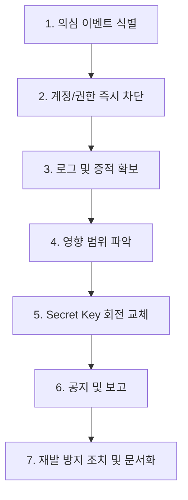

# [4] 보안 및 개인정보 보호 정책서

## 1. 문서 목적 및 개요

본 문서는 와이앤아처 통합 Works 플랫폼 내부 및 외부에서 유통되는 모든 개인정보, 기업 기밀자료, 시스템 암호화 키(Secret Keys)의 오남용과 유출을 방지하기 위한 보안 구현 표준을 정의한다. 

이 정책은 개발 단계부터 적용되며, 배포 및 실제 시스템 운영 단계에서도 엄격하게 강제된다.

---

## 2. 보안 핵심 원칙

1. **최소 권한의 원칙**: 업무 수행에 필요한 최소한의 권한만 제공하며, 불필요한 과도한 권한 부여는 제한한다.
2. **기본 비공개 (Default Private)**: 시스템의 모든 정보는 명시적으로 공개가 정의되지 않는 한 로그인된 관계자만 접근할 수 있는 것을 원칙으로 한다.
3. **필요 최소 개인정보 수집**: 서비스 제공에 반드시 필요한 범위 내의 개인정보만 수집하며, 민감정보 수집은 금지한다.
4. **민감정보 마스킹**: 화면 목록 및 공용 보고서에서는 개인 식별 정보와 금융 기밀 정보에 대한 마스킹(비식별화)을 기본으로 적용한다.
5. **다운로드/Export 제한**: 대량의 데이터 반출을 막기 위해 파일 다운로드와 데이터 내보내기(Export)는 별도 권한을 부여하고 철저히 감시한다.
6. **감사 로그 기록**: 개인정보 원본 조회, 권한 변경, 파일 다운로드, 데이터 내보내기 행위는 수정 불가능한 감사 로그에 기록한다.
7. **운영 및 개발 데이터의 철저한 분리**: 테스트 및 스테이징 환경에 운영 환경의 실제 개인정보를 반입하는 것을 금지한다.
8. **Secret 코드 내 저장 금지**: 코드 저장소(Git)에는 어떠한 암호 키나 인증 자격 증명도 포함하지 않는다.

---

## 3. 데이터 분류 체계

플랫폼 내부 데이터는 민감도와 중요도에 따라 다음과 같이 5가지 등급으로 분류하고 관리한다.

| 분류 등급 | 정의 및 대상 데이터 예시 | 보안 및 처리 기준 |
| :--- | :--- | :--- |
| **`Public`** | 공개된 스타트업 정보, 공개 모집 중인 AC 프로그램 공고 등 | - 접근 제한이 가장 낮음 - 비로그인 상태의 외부 사이트에서도 조회 허용 |
| **`Internal`** | 내부 업무 메모, 프로그램 운영 관련 세부 진척 이력 등 | - 와이앤아처 임직원 및 로그인한 인증 계정만 조회 가능 - 사외 무단 유출 금지 |
| **`Restricted`** | 심사위원 평가 점수, 투자 지분율 및 결성 금액, M&A 딜 협상 조건, 임직원 인사 평가 및 계약 사항 등 | - 특정 지정 권한 그룹 외 접근 원천 차단 (RLS 적용) - 조회, 변경, export 내역이 모두 감사 로그 대상임 |
| **`Personal`** | 이름, 이메일 주소, 전화번호, 거주 주소, 담당자 상세 프로필 등 | - 목록 화면 조회 시 무조건 마스킹 처리 - 상세 조회는 전용 권한자만 가능하며, 원본 조회 시 감사 로그 기록 |
| **`Secret`** | `service_role` 키, Supabase JWT 시크릿, AWS Access Key, 데이터베이스 암호화 키 등 | - 소스코드 커밋 절대 금지 - 브라우저 클라이언트 번들에 절대 포함 금지 (서버 환경 변수 관리) |

---

## 4. 개인정보 보호 및 마스킹 가이드

### 4.1 개인정보 범위 정의
* 이름, 이메일, 전화번호, 주소, 부서/직책, 대표자명 등 개인을 직접적 또는 간접적으로 식별할 수 있는 모든 정보를 개인정보로 분류한다.
* 스타트업 상담 일지나 보육 평가 코멘트에 기재되는 개인적 민감 사항도 개인정보 기준을 준수한다.

### 4.2 화면 마스킹 규칙
사용자가 데이터 목록 조회 화면에 접근할 때, 개인정보 필드는 다음과 같은 마스킹 처리를 거친 후 렌더링되어야 한다:
* **이름**: 3글자 기준 가운데 글자 마스킹 (예: `홍길동` ➔ `홍*동`), 4글자 이상은 앞뒤 1글자씩 제외 후 마스킹 (예: `선우용녀` ➔ `선**녀`), 2글자는 뒤 1글자 마스킹 (예: `김철` ➔ `김*`).
* **전화번호**: 중간 4자리 마스킹 처리 (예: `010-1234-5678` ➔ `010-****-5678`).
* **이메일**: ID의 앞 1글자를 제외한 나머지 글자 마스킹 (예: `honggil@example.com` ➔ `h******@example.com`).
* **주소**: 시/군/구 단위까지만 노출하며 세부 지번 및 아파트 동/호수는 `***`로 숨김 처리 (예: `서울시 강남구 테헤란로 ***`).

### 4.3 원본 데이터 조회 제어
* 마스킹 해제 및 원본 데이터 조회는 해당 화면의 '상세 보기' 패널에서 별도 **[원본 조회]** 버튼을 클릭할 때만 서버에 개별 조회를 요청하여 허용하도록 구현한다.
* 원본 조회가 실행될 때, 시스템은 즉시 `access_logs` 테이블에 누가 언제 누구의 개인정보 원본을 조회했는지의 로그를 자동으로 저장한다.

---

## 5. Secret Key 관리 정책

### 5.1 금지 사항 (Strict Prohibition)
* **Git 커밋 금지**: `.env` 파일이나 하드코딩된 암호화 키를 코드 저장소에 Push하지 않는다. (`.gitignore` 필수 설정)
* **VITE_ 접두사 Secret 사용 금지**: 브라우저 번들에 환경 변수가 인출되는 Vite의 `VITE_` 접두사를 Secret Key 변수명에 사용하지 않는다. Secret은 오직 Supabase Edge Function 등 서버 사이드 환경 변수로만 주입한다.
* **브라우저 번들 포함 금지**: 빌드 및 런타임 클라이언트 번들 파일에 `service_role` 키가 삽입되지 않도록 정적 분석 도구를 세팅한다.
* **서버 로그 노출 금지**: 오류나 디버그 로그 출력 시 `console.log(process.env)` 등으로 전체 암호 키가 노출되는 행위를 원천 금지한다.
* **문서 기록 금지**: Wiki, README 및 기타 기획 문서에 실제 운영 서버의 암호 키나 비밀번호 값을 작성하지 않는다.

### 5.2 관리 대상 Secret 예시
* `SUPABASE_SERVICE_ROLE_KEY`, `SUPABASE_JWT_SECRET`
* `AWS_ACCESS_KEY_ID`, `AWS_SECRET_ACCESS_KEY`
* `APP_ENCRYPTION_KEY` (개인정보 암호화용 마스터 키)
* `INTERNAL_API_SECRET`, `IMPORT_JOB_SECRET` (시스템 간 통신용 토큰)

---

## 6. Service Role 보안 규정

Supabase의 `service_role` key는 데이터베이스 RLS를 즉시 우회하여 전체 데이터 권한을 획득하므로 다음과 같이 특별하게 통제한다.
1. **클라이언트 코드 사용 금지**: 웹 브라우저(클라이언트) 코드상에서는 어떠한 경우라도 `service_role` key의 로드가 불가능하도록 차단한다.
2. **조회 API 사용 금지**: 일반적인 데이터 조회 목적의 API나 서버 컴포넌트에서는 `service_role`을 부여받은 Supabase 클라이언트를 사용해선 안 되며, 사용자의 JWT가 담긴 기본 클라이언트를 활용해야 한다.
3. **제한적 허용 범위**:
   * 대규모 데이터베이스 마이그레이션 (`migration`)
   * 주기적인 백그라운드 배치 작업 (`batch job`)
   * 최종 관리자의 예외적인 특수 승인 처리
   * 외부 시스템으로부터의 대량 데이터 마스터 이관 작업
   * 수정 불가능한 감사 로그(`Audit Log`) 강제 기록 작업
4. **감사 추적성 확보**: `service_role`을 사용하여 데이터베이스를 조작하는 작업은 반드시 별도의 `system_run_logs`에 실행 일시, 작업 목적, 대상 레코드 수를 기록한다.

---

## 7. 파일 및 첨부문서 보안 표준

1. **저장 분리**: 기업 실사 보고서, NDA 문서, 멘토링 매칭 요약본 등의 첨부 파일은 데이터베이스 테이블 내에 바이너리 파일로 직접 저장하지 않으며 AWS S3 또는 Supabase Storage에 보관한다. 데이터베이스에는 파일의 메타데이터(URL, 파일명, 용량 등)만 매핑한다.
2. **파일 보안 등급 분류**: 파일 업로드 시 파일 등급(`public`, `internal`, `restricted`, `confidential`)을 설정한다.
3. **만료 일시가 포함된 서명된 URL (Signed URL) 사용**:
   * `restricted` 및 `confidential` 등급 파일에 대한 접근 경로는 정적 URL로 제공하지 않는다.
   * 사용자가 조회를 요청할 시점에 서버는 사용자 권한을 검증한 후, 5분 이내의 짧은 수명을 가진 임시 서명 URL (Presigned/Signed URL)을 발급하여 다운로드하게 한다.
4. **로그 강제화**: `restricted` 또는 `confidential` 등급 파일을 다운로드받는 모든 행위는 `Audit Log` 대상이며, 다운로드 클릭 시 [다운로드 사유] 입력을 요구하는 다이얼로그를 통해 목적을 확인하고 저장한다.
5. **외부 공유 링크 관리**: 사외 파트너에게 한시적으로 문서를 보여줘야 하는 경우, 만료 시간(최대 48시간)이 존재하고 관리자가 수동으로 권한을 즉시 회수할 수 있는 임시 링크 관리 테이블을 경유하여 제공한다.

---

## 8. Export 및 대량 다운로드 보안

1. **권한 분리**: 엑셀, CSV, PDF 등으로 테이블 내 다수 데이터를 로컬에 내려받는 `Export` 기능은 일반 쓰기 권한과 분리된 **[데이터 반출 권한]** 소유자에게만 제공한다.
2. **대량 반출 통제**: 50건 이상의 레코드를 내보낼 때는 대량 export 작업으로 자동 인식하며, 실행 전 사용자 패스워드 재검증 또는 OTP 추가 인증 단계를 거친다.
3. **감사 기록**: 내보낸 일시, 다운로드한 사용자명, 데이터 건수, 다운로드한 화면 명칭, 다운로드 사유가 영구 기록된다.
4. **민감 필드 필터링**: 내보내는 엑셀 파일 내에서도 개인정보와 투자 지분율 등의 민감 열은 마스킹된 데이터로 기본 반출되며, 마스킹 해제 반출이 필요한 경우 상위 관리자의 사전 전자결재 승인을 요구한다.
5. **보존 기한 관리**: 서버 상에서 임시 생성된 export용 파일(zip, xlsx)은 생성 후 1시간이 지나면 cron job에 의해 물리적으로 영구 삭제된다.

---

## 9. 시스템 로그 보안 기준

* **금지 데이터 지정**: 백엔드 애플리케이션 및 WAS 로그에 아래의 기밀 데이터를 절대 텍스트나 json payload 형식으로 프린트하지 않는다:
  * 비밀번호 원문, Access/Refresh Token, API Secret Key, Service Key
  * 주민등록번호, 외국인등록번호 등 고유식별정보
  * 개인정보 데이터의 입력/수정 시 전체 Payload 통째 출력 금지
* **기록 제어**: 에러 스택 트레이스 출력 시, 에러를 유발한 입력 파라미터가 개인정보를 포함하고 있을 경우 이를 정규식을 통해 공백 또는 마스킹 필터링하여 출력한다.

---

## 10. 외부 사용자 보안 통제 경계

* **스타트업 계정**: GUEST 워크스페이스 내에서 오직 본인이 소속된 회사(`company_id`)의 지원 현황, 참여 보육 프로그램 진행표만 조회가 허용된다. 타사 정보로의 SQL 접근이나 URL ID 변조를 통한 접근은 RLS와 가드에 의해 차단된다.
* **외부 전문가 계정**: 자신이 평가 위원으로 위촉되었거나 멘토링 멘토로 매칭된 멘토링 세션 일지 및 작성할 평가지만 접근이 제한된다. 다른 전문가가 기재한 평가 내용이나 전체 투자 펀드 데이터에 대한 조회 시도는 에러를 발생시킨다.
* **임시 게스트**: 이관된 단기 공유 링크의 유효 토큰 기한이 지나면 즉시 게스트 UI 로그인 세션 자체가 비활성화되고, API 레벨에서 요청이 차단된다.

---

## 11. 보안 사고 대응 절차 (Incident Response Plan)

플랫폼 내부에서 정보 유출 의심 정황, RLS 권한 우회 에러 지속 발생, Secret Key 유출 등이 발견될 시 다음 7단계 절차에 따라 즉각 대응한다.

1. **[1단계] 의심 이벤트 식별**: 비정상적인 IP에서의 대량 다운로드 감지, DB 오류 로그에서의 권한 침해 예외 집계 등 경보 발생.
2. **[2단계] 관련 계정/권한 즉시 차단**: 유출 원인으로 의심되는 계정의 접속 토큰을 강제 만료(Revoke)시키고 계정을 일시 정지 처리.
3. **[3단계] 로그 및 증적 확보**: 변경 불가능한 `audit_logs` 및 AWS Access Logs를 즉시 덤프하여 증적 보존.
4. **[4단계] 영향 범위 파악**: 침입 시간대, 유출된 데이터의 종류 및 레코드 수, 외부 파일 다운로드 여부를 상세 집계.
5. **[5단계] Secret Key 회전 교체**: 유출 의심이 발생한 Secret Key(예: AWS Key, Supabase JWT Secret 등)를 운영 서버 인프라 콘솔에서 즉시 갱신하고 재배포.
6. **[6단계] 공지 및 보고**: 개인정보보호법에 의거, 영향 범위가 확인된 후 법적 보고 시한 내에 유관 부서 및 영향을 받은 당사자(스타트업/개인)에게 사실 통지 및 관리자 보고.
7. **[7단계] 재발 방지 조치 및 문서화**: 보안 취약점 패치 완료 후 원인과 결과를 분석하여 사고 대응 백서 작성 및 관련 코드 가이드라인 업데이트.

---

## 12. 보안 가이드 코드 리뷰 체크리스트

모든 백엔드 및 프런트엔드 풀 리퀘스트(PR) 제출 시 리뷰어는 아래의 기준을 검토한다.
* [ ] 새로 작성되거나 수정된 소스코드 영역에 Secret Key(API 키 등)가 하드코딩되어 커밋되지 않았는가?
* [ ] 웹 브라우저 단에서 사용되는 Supabase Client 객체가 `service_role`을 인스턴스화하고 있지 않은가?
* [ ] 대량 데이터 조회 쿼리가 이루어지는 API에 `Export` 전용 권한 가드(`checkUserPermission`)가 연결되어 있는가?
* [ ] 디버깅을 위해 추가된 `console.log` 또는 백엔드 로깅에 사용자 개인정보나 JWT 토큰이 필터링 없이 노출되지 않는가?
* [ ] 파일 업로드 처리 시, 허가되지 않은 스크립트 확장자(`.js`, `.sh`, `.php` 등)를 서버 미들웨어에서 필터링하고 있는가?
* [ ] 화면 상에 렌더링되는 이메일, 전화번호, 이름에 대해 정의된 마스킹 유틸리티가 누락 없이 적용되었는가?
