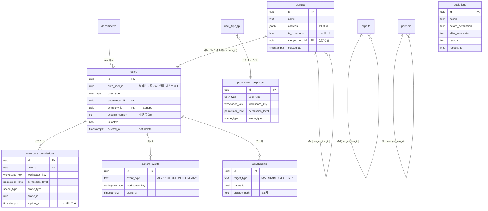

# [9] 데이터베이스 물리 스키마 정의서 (Phase 2)

본 문서는 와이앤아처 통합 Works 플랫폼의 **물리 데이터베이스 스키마**를 정의합니다. Phase 2에서 구현된 공통 기반 테이블, NETWORKS 마스터, RLS 헬퍼/정책, 감사 트리거의 실제 구조를 기술하며, 마이그레이션 파일(`supabase/migrations/`)이 정본입니다.

> [!NOTE]
> 스키마 변경은 반드시 순차 마이그레이션(`YYYYMMDDHHMMSS_*.sql`)으로만 반영합니다. 본 문서는 그 결과를 설명하는 참조 문서이며, 불일치 시 마이그레이션이 우선합니다.

---

## 1. 스키마 구성

| 스키마 | 용도 |
| :--- | :--- |
| **`public`** | 업무 테이블 및 전역 열거형(Enum) |
| **`app`** | RLS 헬퍼 함수·트리거 함수 격리(PostgREST 미노출) |
| **`auth`** | Supabase 인증(표준). 헬퍼는 `auth.jwt()`/`auth.uid()` 경유 |

### 1.1 전역 열거형(Enum)

* **`workspace_key`**: `hub`, `networks`, `ac`, `fund`, `mna`, `project`, `management`, `admin`, `guest`
* **`permission_level`**: `none`, `read`, `write`
* **`scope_type`**: `none`, `global`, `department`, `program`, `project`, `fund`, `company`, `self`, `temporary`
* **`user_type`** (11종): `super_admin`, `executive`, `management_support`, `ac_business`, `fund_manager`, `mna_manager`, `project_manager`, `external_startup`, `external_expert`, `temporary_guest`, `read_only`

---

## 2. ERD (개체-관계 다이어그램)

---

## 3. 테이블 정의 요약

### 3.1 핵심 신원/권한

* **`departments`**: 부서 마스터(`department` scope 기준). `name` 유니크.
* **`users`**: 앱 사용자 통합 레코드. `auth_user_id`(임직원 표준 JWT), `company_id`(외부 스타트업 소속 → `startups`), `session_version`(강제 로그아웃), `is_active`/`deleted_at`(퇴사·정지).
* **`workspace_permissions`**: `(user_id, workspace_key)` 유니크. `permission_level`+`scope_type`+`scope_id`로 최종 권한 판정, `expires_at`로 임시 권한 만료.
* **`permission_templates`**: 사용자 유형별 기본 권한 매트릭스(시드). `(user_type, workspace_key)` 유니크.

### 3.2 공통 지원(다형)

* **`attachments`**: `target_type`+`target_id` 다형 구조로 전 도메인 첨부 통합. `storage_path`는 S3 키(Presigned URL 경유).
* **`audit_logs`**: 권한 변경/민감 액션 증적. **수정·삭제 불가**, 트리거(`app.audit_permission_change`)로만 INSERT.
* **`access_logs`**: 열람/다운로드 사유 로그.
* **`system_events`**: 전사 통합 캘린더(4개 레이어). HUB 조회 센터가 소비.

### 3.3 NETWORKS 마스터 (SSOT)

* **`startups` / `experts` / `partners`**: 스타트업·전문가·협력사 원장. 1:1 부속(주소/연락처/SNS)은 `jsonb` 통합. `is_provisional`(임시 마스터) + `merged_into_id`(중복 병합 정본)로 중복 정리를 지원합니다.

---

## 4. RLS 헬퍼 함수 (2계층)

| 계층 | 함수 | 역할 |
| :--- | :--- | :--- |
| 기저 | `app.current_app_user_id()` | 표준/커스텀 JWT 흡수, `session_version` 대조, 활성 계정 검증 후 앱 사용자 ID 반환 |
| 기저 | `app.current_app_role()` | 현재 사용자 유형 반환 |
| 업무 | `app.is_admin()` | 최고 관리자 여부 |
| 업무 | `app.can_read_workspace(ws_key)` / `app.can_write_workspace(ws_key)` | 워크스페이스 읽기/쓰기 권한(만료 반영) |
| 업무 | `app.get_scope_type(ws_key)` / `app.get_scope_id(ws_key)` | 데이터 범위 유형/기준 ID |
| 업무 | `app.can_access_program/company/fund(id)` | 프로그램/기업/펀드 단위 접근 판정 |

> 모든 RLS 정책은 `auth.jwt()`를 직접 파싱하지 않고 위 헬퍼만 경유합니다.

---

## 5. RLS 정책 원칙 (적용 결과)

* **Default Deny**: 전 테이블 `ENABLE ROW LEVEL SECURITY`. (RLS 커버리지 테스트로 누락 0 검증)
* **읽기/쓰기 분리**: `SELECT` / `INSERT` / `UPDATE` 정책 개별 선언.
* **물리 삭제 차단**: `DELETE` 정책 미선언 → soft delete(`deleted_at` UPDATE) 유도.
* **NETWORKS 마스터**: 내부 `read` 권한자 전람, `write` 권한자 등록/수정, 외부 게스트 직접 접근 불가.
* **감사 로그**: 관리자 조회만, 사용자 직접 INSERT/UPDATE/DELETE 전면 차단.

---

## 6. 검증 현황

* **로컬 회귀 검증(수동 하네스)**: 마이그레이션 8종 순차 적용 성공, RLS/헬퍼 15개 시나리오 전부 통과(관리자 전람·쓰기 분리·무권한 0건·게스트 차단·company 범위·`session_version` 무효화·감사 트리거·RLS 커버리지).
* **pgTAP 회귀 테스트**: `supabase/tests/rls_regression_test.sql`(10계정·8케이스). Docker 로컬 스택에서 `supabase test db`로 실행합니다.

---

## 7. 후속 확장 (다음 Phase)

* FUND/M&A/AC 등 워크스페이스별 업무 테이블(`funds`, `lps`, `deals`, `programs` 등)은 해당 Phase에서 생성하며, 본 문서의 헬퍼(`can_access_fund` 등)를 그대로 재사용합니다.
* 임직원 표준 JWT에 `app_user_id`/`session_version` 클레임을 주입하는 커스텀 액세스 토큰 훅은 Phase 3(인증)에서 구성합니다.
