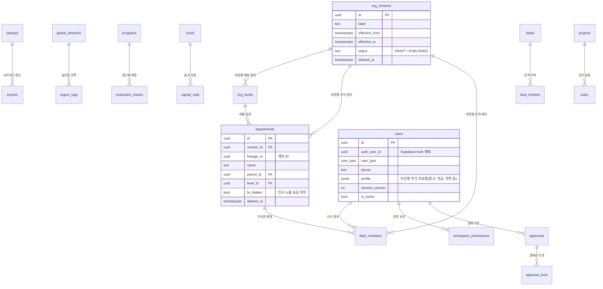

# [9] 데이터베이스 물리 스키마 정의서 (최신 갱신)

본 문서는 와이앤아처 통합 Works 플랫폼의 **물리 데이터베이스 스키마**를 정의합니다. 초기 공통 기반 테이블과 더불어 AC, FUND, M&A, PROJECT, MANAGEMENT(인사/조직도/재무/결재) 워크스페이스의 스키마, 그리고 조직 구조의 다중 버전 및 스냅샷 관리용 테이블 설계가 반영되어 있습니다.

> [!NOTE]
> 스키마의 물리적 정본은 `supabase/migrations/` 내의 순차 마이그레이션 SQL 파일입니다. 본 문서는 개발자와 분석가가 구조를 쉽게 파악할 수 있도록 도식화 및 요약한 문서입니다.

---

## 1. 데이터베이스 구조 및 구성

| 스키마 | 용도 |
| :--- | :--- |
| **`public`** | 사용자/임직원 정보, 각 워크스페이스 비즈니스 업무 테이블 및 공통 Enum |
| **`app`** | PostgREST API에 직접 노출되지 않고 RLS 정책 및 내부 트리거 로직을 격리 수행하는 함수군 |
| **`auth`** | Supabase Auth (임직원 JWT 관리) |

### 1.1 핵심 공통 열거형 (Enum)
* **`workspace_key`**: `'hub'`, `'networks'`, `'ac'`, `'fund'`, `'mna'`, `'project'`, `'management'`, `'admin'`, `'guest'`
* **`permission_level`**: `'none'`, `'read'`, `'write'`
* **`scope_type`**: `'none'`, `'global'`, `'department'`, `'program'`, `'project'`, `'fund'`, `'company'`, `'self'`, `'temporary'`
* **`user_type`**: `'super_admin'`, `'executive'`, `'management_support'`, `'ac_business'`, `'fund_manager'`, `'mna_manager'`, `'project_manager'`, `'external_startup'`, `'external_expert'`, `'temporary_guest'`, `'read_only'`

---

## 2. ERD (개체-관계 다이어그램)

---

## 3. 테이블 정의 요약

### 3.1 인사 조직 관리 (MANAGEMENT)
* **`org_versions`**: 조직도의 가용 기한 및 라이프사이클을 추적합니다. `status`가 DRAFT인 경우 시뮬레이션용이며, PUBLISHED는 정식 운영/예정 버전을 가리킵니다.
* **`org_levels`**: 부서의 수직 위계(예: 회사 ➔ 본부 ➔ 실 ➔ 팀 ➔ 파트)를 관리하며, 조직 버전(`version_id`)마다 스냅샷으로 격리 보존됩니다.
* **`departments`**: 계층 구조를 갖는 부서 테이블입니다. `lineage_id`를 통해 개편 과정에서도 연속적인 부서의 흐름을 보장하고, `hr_hidden` 플래그로 민감 조직의 인사 정보 비공개를 제어합니다.
* **`dept_members`**: `org_versions`별 부서 배치를 격리하기 위한 다대다 교차 테이블로, 특정 임직원(`user_id`)이 특정 조직도 버전(`version_id`)에서 소속된 부서(`department_id`)를 고유하게 보관합니다.

### 3.2 핵심 신원 및 권한
* **`users`**: 플랫폼 전체의 단일 임직원/외부 사용자 원장입니다. Supabase Auth와 연결되는 `auth_user_id`를 보유합니다.
* **`workspace_permissions`**: 사용자별, 워크스페이스별 읽기/쓰기 권한 및 데이터 범위(Scope)를 정의합니다.
* **`permission_templates`**: 11종 사용자 유형에 대해 초기 권한 정보를 매핑해두는 시스템 템플릿입니다.

### 3.3 공통 지원 및 보안
* **`attachments`**: `target_type` 및 `target_id` 다형적 조인 구조를 채택하여 스타트업 서류, 전자결재 증빙 파일 등의 S3 저장소 경로 및 메타데이터를 통합 보관합니다.
* **`audit_logs`**: 권한 변경이나 중요 결재 변경 등 시스템의 민감한 변경 이력을 Append-Only로 영구 저장하는 격리 감사 테이블입니다.
* **`access_logs`**: 민감한 고객 정보/금융 정보 조회 또는 대량 다운로드에 대한 사유 증적 로그입니다.
* **`entity_feedback`**: 다형적 대댓글형 댓글 시스템으로, NETWORKS 마스터 등의 상세 페이지 우측 공용 패널에 통합 연동됩니다.
* **`entity_contributions`**: 마스터 데이터(국내 스타트업/전문가 등)의 등록/수정 기여도 및 연혁 타임라인을 기록합니다.

### 3.4 워크스페이스별 주요 업무 테이블

#### AC (액셀러레이팅 보육 사업)
* **`programs` / `program_modules`**: 보육 프로그램의 개설 정보 및 운영 모듈(신청서, 평가, 멘토링 등)을 정의합니다.
* **`evaluation_sheets` / `evaluation_targets` / `evaluation_grades`**: 동적 평가 질문지와 가중치 스코어링 규칙, 평가 위원들의 배정 및 평점 채점 결과를 수집하는 공통 평가 엔진 테이블입니다.
* **`mentoring_relations` / `mentoring_journals`**: 멘토와 스타트업 간의 n:n 매칭 관계, 회차별 일정 및 상담 일지, 양방향 만족도 평가 정보를 보관합니다.
* **`business_matching_events` / `business_matching_bookings`**: 1:1 매칭 지원을 위한 예약 슬롯 및 상태 트래킹을 수행합니다.

#### FUND (투자 조합 및 펀드)
* **`funds` / `lps`**: 자사 운용 펀드, 출자 금액 및 유한책임사원(LP) 지분 비율을 보관합니다.
* **`capital_calls`**: 펀드 결성에 따른 LP 대상 캐피탈 콜 요청서의 기한과 납입 여부를 트래킹합니다.
* **`investments` / `portfolio_financials`**: 피투자 스타트업별 집행 기록 및 포트폴리오 기업들의 재무/성장 지표를 관리합니다.

#### M&A (인수합병)
* **`deals` / `deal_timeline`**: 매수/매도 딜 소싱 파이프라인의 6단계 진척 현황(칸반) 및 소싱 이력을 추적합니다.
* **`mna_matches`**: 조건별 업종 및 적합도 점수 기반 매칭 결과를 매트릭스 형태로 시각화하기 위해 사용됩니다.

#### PROJECT (업무 프로젝트)
* **`projects` / `tasks` / `milestones`**: 부서별 업무 프로젝트와 태스크 보드(칸반), 그리고 이정표가 되는 마일스톤 일정을 전사 캘린더와 연동하여 관리합니다.

#### MANAGEMENT (ERP)
* **`approvals` / `approval_lines`**: 기안 문서의 순차 검토/승인선 상태 머신(대기/진행/완료/반려)을 제공합니다.
* **`hr_profiles` / `hr_assignments` / `hr_trainings`**: 임직원의 인사 상세 약력, 인사 발령 정보 및 교육 역량 개발 이력을 관리합니다.
* **`dept_budgets`**: 부서별 연간 예산 한도를 명시하고 전자결재 승인액 누계와 대조하여 초과 예산 지출을 경고합니다.
* **`assets`**: 노트북, 법인차량 등 사내 자산의 할당 상태 및 회수 기한을 트래킹합니다.

---

## 4. RLS 헬퍼 함수 (2계층)

| 계층 | 함수 | 역할 |
| :--- | :--- | :--- |
| **기저** | `app.current_app_user_id()` | JWT를 분석하여 현재 로그인된 유효 사용자 ID(`public.users.id`)를 반환합니다. |
| **기저** | `app.current_app_role()` | 현재 로그인된 사용자의 `user_type`을 반환합니다. |
| **기저** | `app.current_org_version_id()` | 오늘 날짜를 기준으로 현재 공식 활성화된 조직도 버전(`org_versions.id`)을 자동 판별합니다. |
| **업무** | `app.is_admin()` | 최고 관리자(super_admin) 권한 여부를 체크합니다. |
| **업무** | `app.can_read_workspace(ws_key)` | 특정 워크스페이스에 대한 읽기(read) 이상 권한 소유 여부를 검증합니다. |
| **업무** | `app.can_write_workspace(ws_key)` | 특정 워크스페이스에 대해 쓰기(write) 권한 소유 여부를 검증합니다. |
| **업무** | `app.get_scope_type(ws_key)` | 사용자가 가질 수 있는 권한 조회 범위(global, department 등)를 반환합니다. |

---

## 5. RLS 정책 원칙

1. **Default Deny**: 모든 비즈니스 테이블에는 `ENABLE ROW LEVEL SECURITY`가 의무 적용되어 있으며, 화이트리스트 정책이 없는 한 외부 접근이 전면 차단됩니다.
2. **소프트 삭제(Soft Delete)**: `deleted_at` 컬럼을 통한 논리적 삭제만 허용하므로, `DELETE` DML에 대한 RLS 정책은 작성하지 않으며 원격 차단합니다.
3. **부서 격리(M&A / HR)**: M&A팀과 관리자/경영진을 제외한 타 부서 임직원이 `deals` 테이블 및 `hr_profiles` 테이블의 개별 행에 액세스하는 것을 방지하기 위해, RLS 업무 헬퍼를 결합한 접근 제어를 수행합니다.
4. **버전별 조직도 격리**: `org_versions`에 RLS 정책을 구성하여 일반 직원들은 `PUBLISHED` 상태인 버전만 조회하도록 유도하고, `DRAFT` 상태는 오직 경영진과 시스템 관리자(management write 보유자)만 볼 수 있도록 통제합니다.

