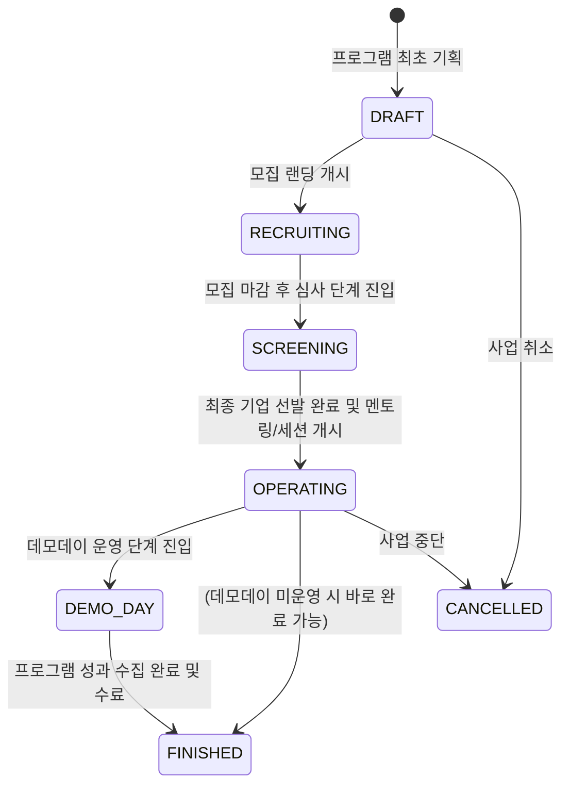

# [3-4-1] AC/Program 대시보드 및 KPI 요약 기획서

본 문서는 와이앤아처 AC 프로그램 운영자가 등록된 스타트업 육성 프로그램들의 단계별 현황을 한눈에 파악하고, 모듈별 운영 지표 및 현장의 위험 신호를 실시간 모니터링할 수 있는 메인 대시보드 화면 및 기능 요건을 명세합니다.

---

## 1. 목적
* 운영자가 다수의 스타트업 프로그램을 동시에 관리하면서 발생할 수 있는 병목 현상(심사 지연, 상담일지 누락, 노쇼, 자료 누락 등)을 사전 감지합니다.
* 프로그램별 핵심 성과 지표(KPI)와 모듈 진행률을 직관적으로 시각화하여 경영진 및 외부 기관 보고 프로세스를 간소화합니다.

---

## 2. 이 문서가 다루는 범위
* 프로그램 목록 조회 및 상태 필터링 기능
* 프로그램별 활성 모듈 구성 정보 및 진행률 시각화
* 당일 최우선 조치가 필요한 '오늘의 운영 이슈' 모니터링 및 즉시 액션 패널
* 전사 차원의 프로그램 통합 성과 KPI 카드 및 만족도 피드

---

## 3. 핵심 사용자
* **내부 운영자 (PROGRAM_OPERATOR)**: 담당 프로그램의 일별 운영 상태를 확인하고 이슈를 처리합니다.
* **프로그램 책임자 (PROGRAM_OWNER)**: 프로그램 전반의 진행률과 누적 성과 지표를 검토합니다.
* **최고 관리자 (internal_admin)**: 전사 프로그램 현황 및 통합 만족도 순위를 총괄합니다.

---

## 4. 정보 구조 (Information Architecture)

```
[대시보드 메인 화면]
 ├── 1. 전사 통합 KPI 요약 위젯 (총 프로그램, 총 스타트업, 누적 멘토링/매칭 완료율)
 ├── 2. 오늘의 운영 이슈 모니터링 보드 (미제출 평가, 미작성 일지, 노쇼, 자료 누락, 발송 실패)
 ├── 3. 프로그램 리스트 그리드
 │    ├── 프로그램 기본정보 (이름, 기간, 기수, 담당자)
 │    ├── 프로그램 대표 상태 (RECRUITING, SCREENING, OPERATING, DEMO_DAY 등)
 │    ├── 모듈별 활성화 칩 및 세부 진행률 게이지 (모집, 평가, 멘토링, 비즈니스 매칭 등)
 │    └── 상세 관리 바로가기 버튼
 └── 4. 실시간 만족도 & 만족도 정성 피드백 위젯
```

---

## 5. 화면 구성

### 5.1 와이어프레임 레이아웃
```
┌────────────────────────────────────────────────────────────────────────┐
│  [대시보드: AC 프로그램 통합 관제 콘솔]                                  │
├────────────────────────────────────────────────────────────────────────┤
│ ┌───────────────────┐ ┌───────────────────┐ ┌────────────────────────┐ │
│ │  운영 프로그램 수   │ │  참가 스타트업 수 │ │  멘토링/매칭 달성률    │ │
│ │  8건 (DRAFT 2 제외) │ │  112개사          │ │  82% (410/500 슬롯)     │ │
│ └───────────────────┘ └───────────────────┘ └────────────────────────┘ │
├────────────────────────────────────────────────────────────────────────┤
│ ⚠️ 오늘의 운영 이슈 (이슈 발생: 5건)                                     │
│ [미제출 평가 3건] [미작성 상담일지 2건] [당일 노쇼 1건] [필수자료 누락 4건] │
├───────────────────────────────────────┬────────────────────────┤
│ ■ 프로그램 관리 보드                    │ ■ 만족도 & 실시간 피드  │
│ [상태 필터: 전체/OPERATING/RECRUITING]│ - [멘토] 홍길동 (5.0)   │
│                                       │   "시장 분석 능력이 탁월"  │
│ ┌───────────────────────────────────┐ │ - [스타트업] A사 (4.8)  │
│ │ 프로그램 명: A-STREAM 2026        │ │   "BM 고도화에 적극 추천"  │
│ │ 상태: OPERATING | 담당: 김민수 선임│ └────────────────────────┘ │
│ │ 활성 모듈:                         │ ■ 모듈 단계 분포 (Pie) │
│ │  [모집:100%] [평가:90%] [멘토링:45%]│ - RECRUITING (12%)     │
│ │  [매칭:대기] [데모데이:대기]         │ - OPERATING (65%)      │
│ │ [상세 관리 바로가기]               │ - FINISHED (23%)       │
│ └───────────────────────────────────┘ └────────────────────────┘ │
└────────────────────────────────────────────────────────────────────────┘
```

---

## 6. 주요 기능

### 6.1 오늘의 운영 이슈 모니터링 (Operational Issue Board)
* **기능**: 당일 실시간 운영 중 감지된 리스크 및 누락 사항을 자동 취합하여 경고 알림 칩으로 표출합니다.
* **모니터링 항목**:
  1. **미제출 평가**: 서면/대면/데모데이 평가 종료일이 D-1일 이하이거나 마감되었으나 아직 '제출(SUBMITTED)' 상태로 전이하지 않은 심사위원 수 및 건수. (클릭 시 미제출자 목록 및 알림 발송 팝업 연동)
  2. **미작성 상담일지**: 멘토링/매칭 완료 후 48시간 이내에 상담일지가 임시저장(`DRAFT`) 상태이거나 미작성된 멘토/전문가 건수.
  3. **노쇼(No-Show) 발생**: 당일 비즈니스 매칭 혹은 멘토링에서 스태프가 '노쇼(NO_SHOW)'로 표시한 슬롯 수. (즉시 대체 매칭 인터페이스 바로가기 링크 지원)
  4. **필수 자료 누락**: 프로그램 참가 확정 기업 중 '사업자등록증' 또는 '개인정보동의서' 등 필수 지정 서류가 미제출된 스타트업 수.
  5. **알림 전송 실패**: 당일 외부 참여자에게 OTP, 일정 링크, 평가 안내 메일/SMS를 발송하는 과정에서 실패한 로그 수.

### 6.2 프로그램 리스트 그리드 및 다중 필터
* **상태별 필터링**: `DRAFT`, `RECRUITING`, `SCREENING`, `OPERATING`, `DEMO_DAY`, `FINISHED`, `CANCELLED` 다중 선택 필터바를 제공합니다.
* **모듈별 진행률 인라인 표출**:
  * 프로그램 카드는 단순 텍스트가 아닌, 활성화된 모듈의 진행 진척률을 렌더링합니다.
  * *모집 모듈*: `(제출 완료 지원서 수 / 총 지원서 수)`
  * *서면/대면 평가*: `(최종 채점 완료 수 / 총 배정 심사 수)`
  * *멘토링/비즈니스 매칭*: `(수행 완료 슬롯 수 / 총 예약된 슬롯 수)`
  * *성과 모듈*: `(만족도 조사 응답 완료 수 / 대상 스타트업 수)`

### 6.3 실시간 만족도 & 피드백 피드 (Feedback & Activity Feed)
* **기능**: 외부 게스트(스타트업, 전문가)가 제출 완료한 정성 피드백 및 별점 점수를 실시간 스트리밍 형태로 롤링 피드 노출합니다.
* **연동**: 클릭 시 해당 만족도를 작성한 구체적인 세션 결과 또는 멘토링 상세 히스토리 뷰로 이동합니다.

---

## 7. 데이터 모델 (대시보드 뷰 전용)

대시보드 화면은 효율적인 렌더링을 위해 다음 필드가 포함된 `materialized view` 또는 집계 쿼리를 기반으로 데이터를 노출합니다.

```typescript
interface ProgramDashboardItem {
  program_id: string; // 프로그램 UUID
  title: string; // 프로그램 공개명
  generation: string; // 프로그램 기수
  status: 'DRAFT' | 'RECRUITING' | 'SCREENING' | 'OPERATING' | 'DEMO_DAY' | 'FINISHED' | 'CANCELLED';
  manager_id: string; // 담당 운영 심사역 UUID
  manager_name: string; // 담당자 이름
  start_date: string;
  end_date: string;
  active_modules: {
    module_type: 'RECRUITMENT' | 'DOC_REVIEW' | 'ONSITE_EVAL' | 'ORIENTATION' | 'MENTORING' | 'BUSINESS_MATCHING' | 'DEMO_DAY' | 'OUTCOMES' | 'CUSTOM_ACTIVITY';
    enabled: boolean;
    progress_percent: number; // 모듈별 자체 계산된 진행률
    issue_count: number; // 해당 모듈 내 미해결 이슈 개수
  }[];
}
```

---

## 8. 상태 모델

프로그램의 대표 상태(`status`)는 다음과 같은 전이 모델을 가집니다. 대표 상태는 운영자가 수동으로 지정하거나, 핵심 모듈의 상태에 따라 동적으로 대표값을 추천받아 저장할 수 있습니다.



---

## 9. 권한/RLS

* **임직원 및 관리자 (internal_admin, internal_operator, internal_staff)**:
  * 본인이 담당하거나 참여하는 프로그램에 대해 전체 대시보드 리스트와 운영 이슈 모니터링 보드를 조회(`SELECT`)할 수 있습니다.
  * `internal_admin`은 전사의 모든 프로그램을 조회 및 수정할 수 있습니다.
* **외부 참여자 (guest_startup, guest_expert, guest_investor)**:
  * 대시보드 전체 조회 권한이 원천적으로 차단됩니다. (GUEST 포털 내의 마이페이지 캘린더 및 자기 할 일 보드만 호출 가능하도록 RLS 정책 차단)

---

## 10. API/RPC/서버 액션

대시보드 로딩 시 개별 집계 쿼리를 반복하여 데이터베이스에 과부하를 주지 않도록 아래와 같은 보안 검증이 적용된 RPC 함수를 호출하여 화면을 렌더링합니다.

* **함수명**: `fn_get_ac_dashboard_summary(p_manager_id uuid, p_status_filter text[])`
  * **설명**: 담당자 UUID 및 상태 필터 배열을 인자로 받아, RLS 정책에 의해 사용자 권한 범위 내의 프로그램 요약 정보 및 미해결 운영 이슈 카운트를 일괄 반환합니다.
  * **보안 검증**:
    * 호출자의 Supabase `auth.uid()`가 내부 직원(`internal_admin`, `internal_operator`, `internal_staff`)인지 검증합니다.
    * 외부 게스트가 본 함수를 호출할 경우 빈 배열을 리턴하거나 익셉션을 발생시킵니다.
    * 감사 로그(`audit_logs`)에 조회자가 대시보드 요약을 호출한 로그를 가볍게 기록합니다. (성능을 위해 다운로드가 아닌 단순 조회의 경우 요약 로그만 적재)

---

## 11. GUEST 연동
* 대시보드 화면 자체는 게스트에게 공유되지 않습니다.
* 그러나 대시보드에 감지되는 운영 이슈 중 '미제출 평가' 및 '미작성 상담일지', '노쇼' 상태는 게스트 API를 통해 각 게스트의 **GUEST 오늘 할 일 위젯**에 즉시 푸시성 데이터로 전달됩니다.

---

## 12. HUB/ADMIN/타 워크스페이스 연동
* **HUB 일정**: 대시보드의 프로그램 기간(`start_date` ~ `end_date`) 및 중요 심사/행사 일정은 전사 `HUB 공통 캘린더`와 실시간 테이블 트리거를 통해 동기화됩니다.
* **ADMIN 감사 로그**: 미제출 평가자에게 강제로 리마인드 알림톡/메일을 발송하는 등의 액션을 수행할 때, ADMIN 워크스페이스의 `감사 로그(Audit Log)`에 실행자명과 대상자 정보가 적재됩니다.

---

## 13. 예외/오류/운영 리스크
* **실시간 집계 지연**: 다수의 대형 프로그램이 동시에 가동될 때 실시간 집계가 느려지는 현상을 방지하기 위해, 모듈별 진척도 계산 로직은 5분 단위의 `Redis 캐시` 혹은 Supabase의 `Materialized View`에 저장하여 주기적으로 갱신하고, 대시보드 조회 시 캐싱된 값을 즉시 반환하도록 설정합니다.
* **노쇼 처리 예외**: 현장 스태프가 잘못 판단하여 '노쇼' 처리했을 경우, 운영자가 대시보드의 이슈 카드에서 직접 '취소/복구' 처리를 지원하여 일정이 정상화되도록 구성합니다.

---

## 14. 완료 기준 (Definition of Done)
1. 프로그램 대표 상태에 따라 다중 필터링이 올바르게 작동하는가?
2. 프로그램별로 활성화된 모듈의 진행률 계산 로직(모집, 평가, 멘토링, 매칭 등)이 정상 작동하고 대시보드 상에 표현되는가?
3. 미제출 평가자나 미작성 일지가 있을 때 경고 알림 칩에 실시간 카운트가 반영되는가?
4. 외부 게스트 계정으로 대시보드 API 호출 시 RLS에 의해 정상 차단되는가?

---

## 15. 테스트 기준
1. **RLS 테스트**: Supabase Client에서 외부 스타트업 토큰으로 `fn_get_ac_dashboard_summary` 함수 호출을 시도하여 에러가 나는지 확인합니다.
2. **이슈 실시간 집계 테스트**: 평가 기한이 도래했으나 제출하지 않은 평가 세션을 임의로 DB에 생성한 뒤, 대시보드의 '미제출 평가' 카운트가 즉각 1 증가하는지 확인합니다.
3. **진행률 정밀도 테스트**: 모집 모듈에서 스타트업 지원 완료 이벤트를 발생시킨 후, 모집 진행률 게이지 값이 수식에 맞추어 정확하게 소수점 1자리까지 변경 렌더링되는지 확인합니다.
