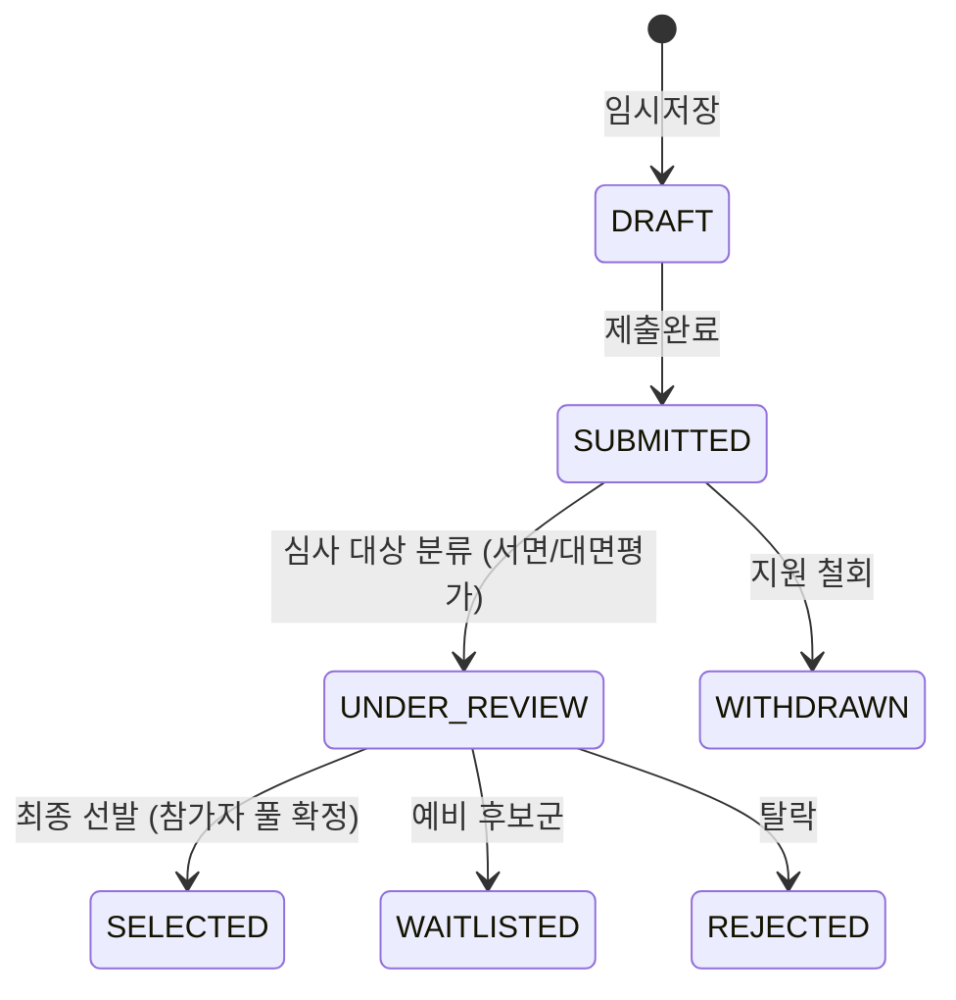

# [3-4-3] AC 기업 모집 및 신청 DB 기획서

본 문서는 프로그램의 최초 진입점인 외부 스타트업 모집 랜딩페이지 생성, 모집 신청서 폼 빌더, 지원자 통합 DB(Application DB) 관리, 그리고 스타트업 제출 서류를 관리하는 자료 제출실의 기능 및 화면 요건을 정의합니다.

---

## 1. 목적
* 코딩 없이 프로그램별 맞춤형 모집 랜딩페이지와 접수 폼을 빠르게 설계하여 외부 공개 모집을 효율화합니다.
* 유입된 지원서 정보를 works 전사의 `NETWORKS 스타트업 마스터 DB`와 즉시 연결하여 마스터 데이터의 단일성(SSOT)을 확보합니다.
* 지원 스타트업이 제출하는 다양한 포맷의 사업소개서, IR 자료, 행정 서류 등을 버전 관리하고, 이를 이후 서면/대면 심사 및 매칭에 단절 없이 공급합니다.

---

## 2. 이 문서가 다루는 범위
* 모집 랜딩페이지 빌더 요건 및 설정 필드 정의
* 동적 신청서 양식 빌더(Form Builder) 스펙
* 지원서 DB 및 상태 흐름(DRAFT ~ SELECTED)
* NETWORKS 스타트업 마스터와의 정규화 매핑 및 병합 프로세스
* GUEST 포털 연동 자료 제출실 및 파일 다운로드 보안 로그 정책

---

## 3. 핵심 사용자
* **내부 운영자 (PROGRAM_OPERATOR)**: 모집 요강을 등록하고 신청서 폼을 빌드하며, 접수 완료된 지원서 현황을 심사하고 승인 상태를 제어합니다.
* **지원 스타트업 (GUEST_STARTUP)**: 외부 URL을 통해 랜딩페이지를 열람하고 신청서를 작성 및 제출하며, 필요 시 자료 제출실에서 서류를 교체합니다.

---

## 4. 정보 구조 (Information Architecture)

```
[모집 및 신청서 관리 흐름]
 ├── 1. 모집 랜딩 빌더 (설명, 포스터, 기간, FAQ 설정)
 ├── 2. 신청서 폼 빌더 (드래그 앤 드롭으로 텍스트/선택/파일/동의 필드 추가)
 ├── 3. Application DB (필터링 및 NETWORKS 매핑 상태, 서류 누락 검수 상태)
 └── 4. 자료 제출실 (스타트업이 업로드한 파일들의 히스토리 및 버전 보존)
```

---

## 5. 화면 구성

### 5.1 관리자용 신청서 폼 빌더 (Form Builder UX)
```
┌────────────────────────────────────────────────────────────────────────┐
│ [모집 관리] > [신청서 폼 빌더]                                         │
├───────────────────────────────────────┬────────────────────────┤
│ ■ 폼 필드 구성 (Form Canvas)          │ ■ 필드 추가 라이브러리 │
│  [필드 #1] 기업명 (text, 필수)         │  [+] 한줄 텍스트 (text)│
│  [필드 #2] 사업자번호 (number, 필수)   │  [+] 장문 텍스트 (area)│
│  [필드 #3] 대표자명 (text, 필수)       │  [+] 단일 선택 (select)│
│  [필드 #4] IR Deck (file, 필수)        │  [+] 다중 선택 (check) │
│      * 허용: PDF / 크기: 최대 50MB     │  [+] 파일 업로드 (file)│
│  [필드 #5] 개인정보동의 (agreement)    │  [+] 동의 체크 (agree) │
│                                       │                        │
│  [ 폼 미리보기 ] [ 폼 설정 저장 ]      │                        │
└───────────────────────────────────────┴────────────────────────┘
```

### 5.2 지원자 DB 및 NETWORKS 연동 매핑 인터페이스
```
┌────────────────────────────────────────────────────────────────────────┐
│ [A-STREAM 2026] > [지원자 DB 목록]                                      │
├────────────────────────────────────────────────────────────────────────┤
│ [필터: 전체/서류제출완료] [정렬: 제출일자순] [검색: 기업명/대표자]     │
├────────────────────────────────────────────────────────────────────────┤
│ 기업명   | 대표자 | 제출시각 | 상태     | NETWORKS 마스터 연결         | │
│ ────────────────────────────────────────────────────────────────────── │
│ 에이전트 | 김철수 | 13:02:11 | SUBMIT   | [매핑 완료: 에이전트테크(주)]| │
│ 스타트B  | 이영희 | 12:45:00 | SUBMIT   | [임시 마스터: 스타트B]       | │
│ 테크놀로 | 박준영 | 11:20:00 | DRAFT    | [연결 대상 없음]             | │
└────────────────────────────────────────────────────────────────────────┘
```

---

## 6. 주요 기능

### 6.1 모집 랜딩페이지 빌더 (Recruitment Landing Builder)
* **공개 URL Slug 정의**: `https://works.ynarcher.com/guest/{program_slug}` 형태의 독립적인 모집 접수 URL이 생성됩니다.
* **구성 항목**: 포스터 배너, 모집 개요, 지원 자격요건, 전체 일정, 필수 제출서류 목록, FAQ 보드, 문의처 정보.
* **모집 기간 통제**: 모집 마감 일시를 초과하면, 지원서 제출(SUBMIT) API 호출 시 서버 단에서 자동으로 요청을 거부하고 "모집 기간이 종료되었습니다" 안내 문구를 노출합니다.

### 6.2 신청서 폼 빌더 (Application Form Builder)
* **지원 필드 타입**:
  * `text`, `textarea`, `number`, `email`, `phone`, `url`
  * `single_select` (라디오/드롭다운), `multi_select` (체크박스 목록)
  * `file` (파일 업로드 - 허용 확장자 및 최대 용량 제한 룰 지정 가능)
  * `agreement` (법적 개인정보/민감정보 활용 동의 체크박스)
* **메타데이터 속성**: 라벨(Label), 설명(Description), Placeholder, 필수 여부(Required), 정렬 순서(Order).

### 6.3 Application DB 및 NETWORKS 마스터 데이터 연동 (Master Matching Flow)
* **정규화 및 매핑 흐름**:
  1. 지원서가 제출(`SUBMITTED`)되면, 시스템은 입력된 `사업자등록증 번호` 또는 `기업명 + 대표자명`을 정규화(공백 제거, 특수문자 제거, 사업자번호 10자리 정형화)합니다.
  2. 정규화된 키 값을 기준으로 전사 `NETWORKS 스타트업 마스터 DB`를 자동 검색합니다.
  3. **일치하는 기업이 있는 경우**: 기존 NETWORKS 마스터 ID를 해당 지원자 레코드의 `startup_id`에 자동으로 외래키 연결합니다.
  4. **일치하는 기업이 없는 경우**: `임시 스타트업 마스터`를 자동으로 생성하고, 병합 대기 상태(Unmerged) 플래그를 설정하여 `startup_id`에 연결합니다. 전사 관리자는 추후 병합(Merge) 콘솔을 통해 이를 정리할 수 있습니다.

### 6.4 자료 제출실 (Document Submission Room)
* **GUEST 포털 연동**: 지원 스타트업은 GUEST 화면에 접속하여 본인이 제출한 IR 자료, 사업자등록증 등의 파일을 언제든 업데이트할 수 있습니다.
* **버전 관리 (Version Control)**:
  * 기존 파일을 덮어쓸 경우, DB 테이블 및 S3 버킷 내의 기존 파일이 영구 삭제되지 않고 버전 이력(`document_versions`) 테이블에 레코드로 유지됩니다.
  * 서면/대면 평가자 및 운영자에게는 언제나 '최신 버전(Is Active)' 플래그가 설정된 파일 경로가 연동 노출됩니다.
* **다운로드 감사 로그**:
  * 운영자나 심사위원이 스타트업의 제출 자료를 다운로드하거나 열람하려고 하면, [다운로드 사유 입력] 팝업이 강제 표시됩니다.
  * 입력된 사유, IP 주소, 다운로드 실행자 UUID, 파일 버전 식별자를 `document_download_logs` 테이블에 기록한 뒤 다운로드용 Presigned URL을 발행합니다.

---

## 7. 데이터 모델 (DB Schema)

### 7.1 application_forms (신청서 양식 테이블)
```sql
CREATE TABLE application_forms (
    id UUID PRIMARY KEY DEFAULT gen_random_uuid(),
    program_id UUID NOT NULL REFERENCES programs(id) ON DELETE CASCADE,
    title VARCHAR(255) NOT NULL,
    instructions TEXT,
    created_at TIMESTAMP WITH TIME ZONE DEFAULT timezone('utc'::text, now()) NOT NULL
);
```

### 7.2 application_form_fields (신청서 개별 필드 설정 테이블)
```sql
CREATE TABLE application_form_fields (
    id UUID PRIMARY KEY DEFAULT gen_random_uuid(),
    form_id UUID NOT NULL REFERENCES application_forms(id) ON DELETE CASCADE,
    field_type VARCHAR(50) NOT NULL,            -- text, select, file 등
    label VARCHAR(255) NOT NULL,
    description TEXT,
    placeholder VARCHAR(255),
    is_required BOOLEAN NOT NULL DEFAULT FALSE,
    options JSONB,                              -- select 유형의 선택지 배열 (JSON)
    file_constraints JSONB,                     -- 용량 제한, 확장자 제한 JSON
    sort_order INT NOT NULL DEFAULT 0
);
```

### 7.3 application_submissions (지원자 접수 마스터 테이블)
```sql
CREATE TABLE application_submissions (
    id UUID PRIMARY KEY DEFAULT gen_random_uuid(),
    program_id UUID NOT NULL REFERENCES programs(id) ON DELETE CASCADE,
    startup_id UUID NOT NULL,                   -- NETWORKS 스타트업 마스터 매핑 UUID (임시 마스터 포함)
    status VARCHAR(50) NOT NULL DEFAULT 'DRAFT',-- DRAFT, SUBMITTED, SCREENING, SELECTED 등
    submitted_at TIMESTAMP WITH TIME ZONE,
    created_at TIMESTAMP WITH TIME ZONE DEFAULT timezone('utc'::text, now()) NOT NULL,
    updated_at TIMESTAMP WITH TIME ZONE DEFAULT timezone('utc'::text, now()) NOT NULL
);
```

### 7.4 application_answers (동적 지원 폼 입력값 테이블)
```sql
CREATE TABLE application_answers (
    id UUID PRIMARY KEY DEFAULT gen_random_uuid(),
    submission_id UUID NOT NULL REFERENCES application_submissions(id) ON DELETE CASCADE,
    field_id UUID NOT NULL REFERENCES application_form_fields(id) ON DELETE CASCADE,
    text_value TEXT,
    json_value JSONB,                           -- 다중선택이나 파일 업로드 메타 정보용
    created_at TIMESTAMP WITH TIME ZONE DEFAULT timezone('utc'::text, now()) NOT NULL
);
```

---

## 8. 상태 모델

* **지원서 상태 (`application_submissions.status`)**:


---

## 9. 권한/RLS

* **내부 임직원 (PROGRAM_OPERATOR)**:
  * 본인 프로그램의 지원서 내역(`application_submissions`, `application_answers`)에 대해 전체 읽기/쓰기 권한을 가집니다.
* **외부 지원 기업 (guest_startup)**:
  * 본인이 제출한 지원서 레코드에 한해 읽기(`SELECT`) 및 수정(`UPDATE`)이 가능합니다. (상태가 `DRAFT`인 경우에만 수정 가능, `SUBMITTED` 이후에는 조회만 허용)
  * RLS Policy: `auth.uid() = (SELECT user_id FROM startups WHERE id = startup_id)`

---

## 10. API/RPC/서버 액션

* **함수명**: `fn_submit_application(p_submission_id uuid)`
  * **설명**: 임시 저장된 지원서를 최종 제출 상태로 변경하고, NETWORKS 마스터 연동 로직을 트리거합니다.
  * **검증 규칙**:
    * 모집 기간 마감 여부를 대조 검증합니다.
    * 필수 폼 필드가 모두 누락 없이 채워졌는지(`application_answers` 레코드 존재 여부) 백엔드 단에서 유효성 검사합니다.
    * 중복 지원 여부(동일 프로그램에 동일 사업자번호가 이미 `SUBMITTED` 되었는지) 검사합니다.

---

## 11. GUEST 연동
* 외부 신청자가 지원서를 입력하거나, 제출 마감 후 자료 제출실에서 서류를 재제출할 때 GUEST 모바일 앱 화면의 파일 업로더 컴포넌트를 이용합니다.
* GUEST 화면에서는 제출 완료 후 상태가 `UNDER_REVIEW`로 바뀌면 지원서 폼 자체는 수정 불가능하게 잠금 처리되고 읽기 전용 상태가 됩니다.

---

## 12. OFFICE/ADMIN/타 워크스페이스 연동
* **NETWORKS 스타트업 마스터**: `fn_submit_application` 내부에서 사업자등록번호 기반 정규화 쿼리가 작동하여 `startups`의 UUID를 가져옵니다.

---

## 13. 예외/오류/운영 리스크
* **대용량 파일 업로드 오류**: S3 업로드 도중 네트워크 끊김 현상이 발생할 수 있으므로, 10MB 이상의 대용량 파일(예: IR Deck) 업로드 시에는 **멀티파트 업로드(Multipart Upload)** 및 GUEST 화면 상에 진행률 프로그레스 바를 렌더링하고, 파일 청크 실패 시 재전송(Retry)을 보장합니다.

---

## 14. 완료 기준 (Definition of Done)
1. 모집 마감 시각 이후에 지원서 제출 호출 시 차단되는가?
2. 동적으로 생성된 신청서 폼 필드가 외부 랜딩페이지에 정확히 노출되며 유효성 검증이 작동하는가?
3. 지원서가 제출되었을 때 사업자번호에 따라 NETWORKS 스타트업 마스터와 매핑되거나 임시 마스터가 정상 자동 생성되는가?
4. 자료 제출실의 파일 변경 시 이전 버전의 레코드가 유실되지 않고 히스토리 테이블에 보존되는가?
5. 파일 다운로드 시 사유 입력이 기록되고 보안 로그에 적재되는가?

---

## 15. 테스트 기준
1. **정규화 매핑 테스트**: NETWORKS 마스터에 `123-45-67890`으로 등록된 기업이 있을 때, 외부 게스트가 `1234567890`으로 입력해 지원서를 제출한 경우, DB의 `startup_id` 컬럼에 해당 NETWORKS 기업의 UUID가 정확히 매핑되는지 검증합니다.
2. **버전 관리 테스트**: 자료 제출실에 최초 A.pdf를 업로드한 후 B.pdf로 교체했을 때, `document_versions` 테이블에 A.pdf 정보가 보존되어 있으며 최신 다운로드 링크는 B.pdf를 반환하는지 확인합니다.
