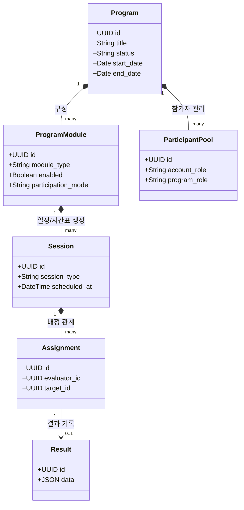
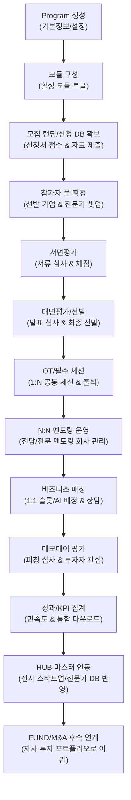

# [3-4] AC 워크스페이스 통합 기획서 및 인덱스 (Program First)

본 문서는 works 플랫폼 내 AC(Accelerating) 워크스페이스의 최상위 아키텍처와 비즈니스 흐름을 정의하며, 하위 개별 기능 명세서의 인덱스 역할을 수행합니다.

---

## 1. 목적 및 개요

AC 워크스페이스는 와이앤아처가 주관하는 모든 스타트업 보육 및 육성 사업을 **Program First** 관점에서 통합 관리하는 섹션입니다. 단순한 "일정 관리" 또는 "보육 기업 목록 관리"에 그치지 않고, 개별 보육 프로그램을 단위로 삼아 모집, 평가, OT, 멘토링, 비즈니스 매칭, 데모데이, 성과 관리 등의 비즈니스 모듈을 선택적으로 조립하여 운영할 수 있는 **모듈형 스타트업 프로그램 운영 플랫폼**으로 기능합니다.

이를 통해 다음과 같은 가치를 제공합니다.
* **업무의 모듈화**: 각 프로그램의 목적에 맞춰 필요한 기능(모듈)을 유연하게 활성화하고 배치합니다.
* **데이터의 연속성**: 모집 단계에서 확보된 신청서 및 기업 자료가 서면/대면 심사, 멘토링, 매칭, 데모데이를 거쳐 최종 KPI 및 성과 리포트까지 단절 없이 유기적으로 연동됩니다.
* **사용자 경험의 최적화**: 내부 운영자는 WORKS ADMIN 및 관리자 화면에서 전체 현황을 통제하고, 외부 참여자(스타트업, 전문가, 멘토, 심사위원, 투자자)는 제한된 권한 하에 모바일에 최적화된 GUEST 포털을 통해 자기 할 일만 명확하게 처리합니다.

---

## 2. 핵심 정보 구조 (Information Architecture)

AC 워크스페이스의 데이터와 비즈니스 모델은 아래의 6가지 핵심 계층으로 구성됩니다.

1. **Program (프로그램)**
   * 최상위 비즈니스 단위입니다. (예: `A-STREAM 2026`, `창업도약패키지 지원사업`, `글로벌 오픈이노베이션 3기`)
2. **Program Module (프로그램 모듈)**
   * 프로그램 내부에서 활성화/비활성화할 수 있는 개별 업무 기능 단위입니다.
   * 주요 모듈: `Recruitment`(모집), `Doc Review`(서면평가), `Onsite Eval`(대면평가), `Orientation`(OT/출석), `Mentoring`(N:N 멘토링), `Business Matching`(1:1 매칭), `Demo Day`(데모데이), `Outcomes/KPI`(성과), `Custom Activity`(비정형 기록)
3. **Participant Pool (참가자 풀)**
   * 프로그램에 소속된 이해관계자의 통합 풀입니다. 스타트업, 전문가(멘토, 심사위원, 투자자), 운영자, 스태프 등이 정의되며, 각 모듈은 이 풀에서 대상자를 할당받아 운영됩니다.
4. **Session (세션)**
   * 시간표에 등록되어 실행되는 개별 일정 단위입니다. (예: `1회차 멘토링`, `대면평가 3번 발표 슬롯`, `비즈니스 매칭 테이블 1 슬롯 2`)
5. **Assignment (배정)**
   * 세션 내에서 발생하는 주체 간의 연결 관계입니다. (예: `평가자 - 피평가 기업`, `멘토 - 멘티 스타트업`, `상담 전문가 - 참여 스타트업`)
6. **Result (결과)**
   * 배정 및 세션 실행 후 도출되는 최종 결과 데이터입니다. (예: `평가 제출지`, `상담일지`, `출석부`, `만족도 피드백`, `투자 유치 성과`)

---

## 3. AC 프로그램 핵심 라이프사이클

프로그램 데이터는 단절 없이 순차적이고 유기적인 흐름을 따라 이동합니다.

---

## 4. 세부 기획 문서 인덱스 (14개 확장 구조)

AC 워크스페이스의 업무 모듈과 운영 세부 사항은 명확한 경계에 따라 총 14개의 하위 문서로 분할되어 상세히 정의됩니다.

| 문서 번호 | 상세 기획 문서 링크 | 핵심 기능 및 다루는 범위 |
| :--- | :--- | :--- |
| **[3-4-1]** | [3_4_1_ac_dashboard.md](./3_4_1_ac_dashboard.md) | **Program 대시보드**: 프로그램별 진행 단계 필터, 모듈별 진행률, 오늘 해결해야 할 운영 이슈(미제출 평가, 누락 파일, 노쇼 등) 모니터링 |
| **[3-4-2]** | [3_4_2_ac_program_overview.md](./3_4_2_ac_program_overview.md) | **Program 개요 및 모듈 보드**: 프로그램 기본 정보 설정, 개별 모듈 On/Off 보드, 모듈별 참여/배정 방식(`participation_mode`) 정의 |
| **[3-4-3]** | [3_4_3_ac_recruitment.md](./3_4_3_ac_recruitment.md) | **기업 모집 및 신청 DB**: 모집 랜딩페이지 빌더, 신청서 폼 빌더, 지원 스타트업 DB 관리 및 자료 제출실 명세 |
| **[3-4-4]** | [3_4_4_ac_participant_pool.md](./3_4_4_ac_participant_pool.md) | **참가자 풀 및 역할 관리**: 계정 역할(Internal/Guest)과 프로그램 참여 역할(Reviewer, Startup, Mentor 등) 분리, 일괄 업로드 및 권한 매핑 |
| **[3-4-5]** | [3_4_5_ac_evaluation_engine.md](./3_4_5_ac_evaluation_engine.md) | **공통 평가 엔진**: 서면/대면/데모데이 평가에서 공동 재사용하는 동적 평가표 빌더, 지표/배점/가중치 구조, 점수 집계 공통 코어 |
| **[3-4-6]** | [3_4_6_ac_document_review.md](./3_4_6_ac_document_review.md) | **서면평가 모듈**: 신청 데이터 및 제출 PDF 자료 기반 평가, 심사위원 전용 Split View 평가 인터페이스 명세 |
| **[3-4-7]** | [3_4_7_ac_onsite_evaluation.md](./3_4_7_ac_onsite_evaluation.md) | **대면평가 모듈**: 현장 발표/인터뷰 시간표 구성, 대면 심사위원 배정, 발표 순서 관리, 실시간 현장 진행 상태 변경 및 심사 |
| **[3-4-8]** | [3_4_8_ac_orientation_sessions.md](./3_4_8_ac_orientation_sessions.md) | **OT 및 공통 세션**: 1:N 세션 등록, 참석 대상 스타트업 지정, QR 코드 및 수동 출석 체크, 참석/지각/불참 상태 관리 |
| **[3-4-9]** | [3_4_9_ac_mentoring.md](./3_4_9_ac_mentoring.md) | **N:N 멘토링 관계 및 회차**: 멘토-멘티 매핑, 다회차 멘토링 일정 수립, 멘토 상담일지 작성 및 스타트업 히스토리 누적 관리 |
| **[3-4-10]** | [3_4_10_ac_business_matching.md](./3_4_10_ac_business_matching.md) | **1:1 비즈니스 매칭**: 상담 테이블 생성, 가용 시간대 슬롯 자동 생성, 자율 예약, AI 기반 자동 배치 매칭, 노쇼 대체 및 현장 조율 |
| **[3-4-11]** | [3_4_11_ac_demo_day.md](./3_4_11_ac_demo_day.md) | **데모데이 및 투자자 관심**: 발표 피칭 세션 관리, 모바일 스코어보드, 투자자 관심 기업 체크(Watch/Meeting/Invest) 및 후속 연계 관리 |
| **[3-4-12]** | [3_4_12_ac_program_timeline.md](./3_4_12_ac_program_timeline.md) | **통합 타임라인 및 충돌 방지**: 전체 세션 일정의 시간축 통합 뷰, 스타트업/전문가/장소 간의 시간 중복 충돌 검사 및 이동 버퍼 계산 |
| **[3-4-13]** | [3_4_13_ac_outcomes_kpi_export.md](./3_4_13_ac_outcomes_kpi_export.md) | **성과 지표 및 통합 다운로더**: 모듈별 운영 KPI(신청률, 심사 제출률, 만족도 등) 집계, 기업별 누적 타임라인, Excel 통합 다운로더 |
| **[3-4-14]** | [3_4_14_ac_custom_activities.md](./3_4_14_ac_custom_activities.md) | **커스텀 활동 기록**: 비정형 행사, 회의록(Action Items 포함), 사진, 첨부파일을 Program/Session에 매핑하여 아카이빙 |

---

## 5. 외부 및 타 워크스페이스 연동 구조

AC 워크스페이스는 works의 다른 핵심 아키텍처와 유기적으로 데이터를 공유하며, 보안 경계를 유지합니다.

1. **[HUB 마스터 데이터 연동 (3-1)](./3_1_workspace_hub.md)**:
   * 모집 단계 및 참가자 풀에 스타트업/전문가가 등록될 때, 주민등록번호/사업자번호/이름 등을 기준으로 `HUB 스타트업/전문가 마스터 DB`를 자동 조회 및 매핑합니다.
   * 일치하는 정보가 없으면 임시 마스터를 개설하고, 추후 전사 관리자가 병합할 수 있도록 후보로 등록합니다.
2. **[FUND 자사 투자 연동 (3-5)](./3_5_workspace_fund.md)**:
   * 보육 성과 지표에서 투자 유치 성과가 입력되거나, 당사 투자 본부에서 해당 스타트업에 투자를 완료하면 자사 포트폴리오 플래그가 자동 활성화되어 스타트업 마스터 상세 뷰에 최우선 반영됩니다.
3. **[GUEST 외부 참여자 전용 앱 연동 (3-9)](./3_9_workspace_guest.md)**:
   * 스타트업 대표, 심사위원, 멘토, 투자자 등 외부 참여자는 WORKS의 내부 업무망(WORKS ADMIN/WEB)에 **절대 직접 로그인할 수 없습니다.**
   * 외부 참여자는 `GUEST 웹/모바일` 전용 UI를 통해서만 시스템을 이용하며, Supabase RLS 정책에 의해 자신이 소속된 프로그램 및 배정된 세션 데이터에만 엄격하게 접근(Scope 제한)이 허용됩니다.

---

## 6. 완료 기준 (Definition of Done)

본 AC 기획 문서 보강 및 개발 시 다음 사항이 모두 충족되어야 작업이 완료된 것으로 판단합니다.
1. **Program First 구조화**: AC 섹션 내의 모든 개별 기능 명세서가 Program-Module-Session의 계층 관계를 따르고 있는가?
2. **보안/RLS 경계 확립**: 외부 참여자가 GUEST 앱을 경유하여 배정된 데이터(`Assignment`) 외의 영역에 접근할 수 없도록 RLS 매트릭스가 명시되었는가?
3. **상태 전이 RPC 처리**: 신청 제출, 평가 완료, 예약 확정 등 중요 비즈니스 상태의 변경이 클라이언트 직접 수정이 아닌 서버의 RPC(또는 Server Action) 함수로 구현되도록 계약이 설계되었는가?
4. **디자인 표준 준수**: 기존 `matching` 서비스의 UI를 임의로 복제하지 않고, works 공통 UI 가이드라인(AppShell, DataTable, SplitView 등)을 기준으로 설계가 통일되었는가?

---

## 7. 테스트 기준

1. **통합 시나리오 테스트**:
   * 모집 등록 ➔ 외부 신청 ➔ 서면/대면 심사 배정 및 평가 ➔ 참가 스타트업 확정 ➔ 멘토링/매칭 스케줄링 ➔ 상담일지 작성 ➔ 만족도 및 KPI 집계 ➔ Excel 다운로드로 이어지는 라이프사이클의 일관성 검증.
2. **권한 및 RLS 차단 테스트**:
   * A 프로그램의 심사위원이 GUEST 화면을 통해 B 프로그램의 기업 정보나 배정되지 않은 평가표에 접근을 시도할 때 차단(403 Forbidden 및 Supabase Policy 위반 에러)되는지 검증.
3. **동시성 및 충돌 방지 테스트**:
   * 1:1 비즈니스 매칭 또는 멘토링 스케줄링 시, 동일 스타트업이나 멘토에게 겹치는 시간대 슬롯이 중복 배정되지 않도록 하는 유효성 검사 로직의 작동 여부 검증.
