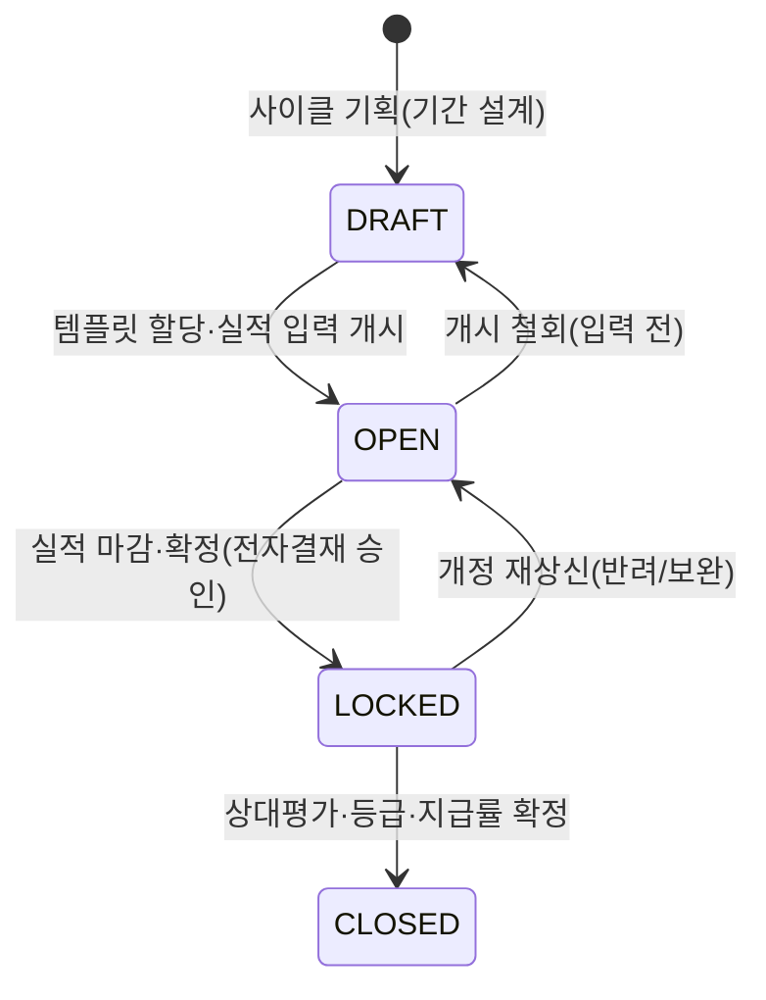

# [3-7-1] MANAGEMENT 조직 성과·KPI 관리 기획서

본 문서는 MANAGEMENT 워크스페이스의 조직/부서 관리 구조 위에서, **부서(그룹) KPI와 개인 KPI를 항목별로 서로 다른 점수 규정으로 유연하게 커스터마이즈**하고, 목표 설정 → 실적·증빙 입력 → 점수 산출 → 상대평가·등급·인센티브 지급률까지를 하나의 성과관리 주기(사이클)로 운영하기 위한 화면 및 기능 요건을 명세합니다. 상위 워크스페이스 기획은 [3_7_workspace_management.md](./3_7_workspace_management.md), 조직/부서 버전 구조는 이미 구현된 `조직 관리` 기능을 전제합니다.

> [!NOTE]
> 본 기획은 사내 실제 「2026년 KPI 세부기준」의 구조(부서/개인 이원화, 본부별 상이한 항목 세트, 항목별 상이한 점수 규정, 정량 상대수·절대수 혼재, 정성 등급 평가, 상대평가·정원 배분·조건부 보정·인센티브 지급률)를 데이터로 표현 가능하도록 설계되었습니다.

---

## 1. 목적
* 매 조직 개편마다 조직 레벨·부서명을 새로 정의하면서도, 그 조직과 임직원이 무엇을 목표로 삼고 얼마나 달성했는지를 관리하는 **성과관리 프로세스**의 부재를 해소합니다.
* KPI를 특정 시점 부서가 아닌 **조직 계보(lineage)에 귀속**시켜, 조직 개편(이름·상위 조직 변경)이 발생해도 목표·실적·결과가 단절 없이 연속되도록 보장합니다.
* **부서 KPI와 개인 KPI가 서로 다르고, 항목마다 점수 규정(정량/정성, 상대수/절대수, 구간·건당·등급)이 제각각인 현실**을, 정해진 점수화 규칙(스코어링 룰)을 파라미터로 채워 만드는 **커스터마이즈 가능한 스코어링 엔진**으로 흡수합니다.
* 관리자가 코드 수정 없이 화면에서 KPI 항목·구간·배점·적용 대상을 직접 설계·복제하는 **노코드 빌더**를 제공하여, 매년 바뀌는 KPI 기준에 개발 없이 대응합니다.

---

## 2. 이 문서가 다루는 범위
* **포함**:
  * 성과관리 주기(사이클)의 자유 정의 및 상태 머신
  * **지표 카탈로그(Metric)** — 재사용 가능한 측정 지표 정의
  * **스코어링 룰(Scoring Rule)** — 값을 점수로 변환하는 규칙(구간 매핑 / 건당 누적+한도 / 등급 매핑), 음수 점수·상한 개방·합계 한도 지원
  * **KPI 템플릿(Template) 노코드 빌더** — 조직용/개인용 × 본부·계보 × 역할별 항목 묶음 설계·복제(복수 생성)
  * 대상 배정 및 대상별 목표값(target) 오버라이드
  * 실적 입력 및 전자문서 증빙 연동
  * 대상 할당(수동+자동 추천, 복수 겹침) 및 조직·개인 롤업 뷰
  * 점수 산출 엔진 및 템플릿 종합점수 집계
  * 상대평가·정원(Quota) 배분 등급(S~E), 조건부 보정, 인센티브 지급률, MI 지표
* **제외(별도 범위)**:
  * 급여·인센티브 **실지급** 시스템 연동 — 본 기획은 지급률 산출까지만 다룹니다.
  * 실적값 **자동 집계** 파이프라인(재무·매출 자동 연동) — 수동 입력 + 증빙 기준이며 v2 후속 과제입니다.
  * Supabase 마이그레이션 및 프론트엔드 구현 — 7·10절은 개념 설계 서술까지만 다룹니다.

---

## 3. 핵심 사용자
* **KPI 설계자 (`super_admin`, management write)**: 지표·스코어링 룰·KPI 템플릿을 노코드 빌더로 설계·복제하고, 템플릿을 조직/개인에 할당하며, 사이클과 정원·보정 정책을 운영합니다.
* **경영진 (`super_admin`, 대표)**: 전사 종합 현황을 조망하고, 부서 정성평가(대표 평가)와 최종 등급·지급률을 확정합니다.
* **조직장 (부서 배치된 리더)**: 본인 소속 계보 및 하위 조직의 실적·증빙을 입력하고, 소속 임직원의 개인 평가(리더평가)를 수행합니다.
* **임직원 (내부 직원 전원)**: 본인 개인 KPI의 실적·증빙과 동료평가를 입력하고, 확정된 본인 결과·등급·지급률을 열람합니다.

---

## 4. 정보 구조 (Information Architecture)

`성과·KPI 관리` 탭은 기존 `조직 관리` 탭과 형제 관계로 배치되며, 조직도 트리와 계보를 공유합니다. 구조는 **재사용 카탈로그(지표·룰) → 템플릿 빌더 → 대상 할당 → 실적/증빙 → 집계/평가**의 흐름입니다.

```
[성과·KPI 관리 탭]
 ├── 1. 사이클 선택 바 (현재/예정/종료 사이클 + 상태 배지 + 사이클 생성)
 ├── 2. 설계(빌더) 영역  [KPI 설계자 전용]
 │    ├── 지표 카탈로그 (Metric: 이름·단위·정량/정성·값성격·방향성·산정각주)
 │    ├── 스코어링 룰 (Rule: BAND / PER_UNIT_CAP / GRADE_MAP + params 편집)
 │    └── KPI 템플릿 (Template: 조직용/개인용 두 종류, 복수 생성 = 첨부문서 '한 장', 복제 지원)
 ├── 3. 할당 영역 (템플릿 → 조직 계보/임직원 할당 + 대상별 목표값 오버라이드, 수동+자동추천, 복수 겹침)
 ├── 4. 실적 입력 (항목별 실적값/정성등급 + 전자문서 증빙 링크)
 └── 5. 집계·평가 대시보드
      ├── 조직 상세 뷰: 조직 템플릿 결과 + 구성원 개인 템플릿 롤업
      ├── 개인 뷰: 내 소속 조직의 조직 템플릿 + 나에게 할당된 개인 템플릿
      ├── 템플릿 종합점수 (가중 합산, 조직도 트리 오버레이)
      ├── 상대평가 → 정원 배분 → 등급(S~E)
      ├── 조건부 보정 (회사 총매출/이익률 트리거)
      └── 인센티브 지급률 · MI 지표
```

> [!NOTE]
> **조직↔개인 롤업은 새 데이터 없이 소속(`dept_members`) 조인만으로 도출됩니다.** 조직 상세는 그 조직(계보)에 할당된 조직 템플릿 + 구성원들에게 할당된 개인 템플릿을 모으고, 개인 화면은 사이클 시점 소속 조직의 조직 템플릿 + 본인에게 할당된 개인 템플릿을 봅니다. 소속 매핑은 기존 `useActivePlacementMap`([orgHooks.ts](../../apps/works/src/features/management/orgHooks.ts))을 재사용합니다.

> [!NOTE]
> 조직도 트리와 조직 소속 판정은 `조직 관리`의 버전 스냅샷(`departments`·`dept_members` × `version_id`/`lineage_id`)을 원천으로 재사용합니다. 성과 데이터(목표·실적·결과)는 부서의 시점 id가 아니라 계보(`lineage_id`)에 귀속됩니다.

---

## 5. 화면 구성

### 5.1 스코어링 룰 빌더 (구간 테이블 에디터)
```
┌──────────────────────────────────────────────────────────────┐
│ [스코어링 룰 편집]  이름: 매출 달성률 룰   유형: [BAND ▼]      │
├──────────────────────────────────────────────────────────────┤
│  구간 min   구간 max    점수      [+ 행 추가]                  │
│  140%       160%        120                                    │
│  120%       140%        100                                    │
│  70%        80%         30                                     │
│  (없음)     70%         10                                     │
│  ☑ 상한 개방: 160% 초과부터 [10]%마다 [+10]점                 │
│  ☑ 음수 점수 허용   하한 클램프: [-20]                        │
└──────────────────────────────────────────────────────────────┘
```

### 5.2 KPI 템플릿 빌더 + 실적/평가 대시보드
```
┌────────────────────────────────────────────────────────────────────────┐
│ [성과·KPI 관리]  사이클: [2026년 · OPEN ▼]                              │
├───────────────────────────────────────┬────────────────────────────────┤
│ ■ KPI 템플릿: AC본부 그룹 KPI          │ ■ 실적/점수: 스케일업그룹        │
│  scope: 조직용 | 본부: AC | 역할힌트: — │  종합점수: 612 · 등급 A (2위)   │
│  [템플릿 복제] [항목 추가]             │ ───────────────────────────────  │
│  ┌──────────────────────────────────┐ │ 매출 KPI (BAND) 목표25억         │
│  │ 매출 KPI      · 룰:매출달성률 ·배점120│ │  실적 21.6억 · 86% → 60점 [증빙]│
│  │ 이익률 KPI    · 룰:이익률   ·배점120│ │ 출자금액 (BAND, 절대)            │
│  │ 출자금액 확보 · 룰:출자금   ·배점140│ │  실적 1.4억 → 80점 [증빙]        │
│  │ 언론기사      · 룰:기사건수 ·배점100│ │ 부서 정성평가(대표) (GRADE_MAP)  │
│  │ …                                  │ │  등급 B(88점) → 70점            │
│  └──────────────────────────────────┘ │ [점수 재계산] [확정 상신]        │
├───────────────────────────────────────┴────────────────────────────────┤
│ ■ 상대평가/등급  1위 S · 2위 A · … | 정원: S그룹 S 60%이내 · A 40%이내  │
│  조건부 보정: 회사 총매출 100%+이익률 35% 달성 → 4위↓ B 상향 [적용됨]    │
└────────────────────────────────────────────────────────────────────────┘
```

* **룰 빌더**: 유형(`BAND`/`PER_UNIT_CAP`/`GRADE_MAP`) 선택 시 해당 파라미터 편집 폼으로 전환합니다. 구간은 행 추가/삭제로 편집합니다.
* **템플릿 빌더**: 조직 관리의 `OrgVersionBar`/`OrgTreeEditor` UI 패턴을 재사용하며, 템플릿 복제로 전년도 기준을 빠르게 승계합니다.

---

## 6. 주요 기능

### 6.1 지표 카탈로그 (Metric)
* **기능**: 측정 지표를 재사용 단위로 정의합니다. 속성은 이름, 단위(%/억원/건/명/만원), 측정 유형(`QUANT`/`QUAL`), 값 성격(`RATE` 달성률 / `RATIO` 비율 / `AMOUNT` 금액 / `COUNT` 건수 / `QUAL` 정성), 방향성(`UP`/`DOWN`), 산정 각주(예: "출자금은 당해년도 입금분만 인정")입니다.
* 하나의 지표는 여러 템플릿에서 서로 다른 룰·배점·목표로 재사용될 수 있습니다.

### 6.2 스코어링 룰 빌더 (Scoring Rule)
값을 점수로 변환하는 규칙을 3종 아키타입의 파라미터로 정의합니다. 모두 음수 점수를 허용합니다.
* **`BAND` (구간 매핑)**: 값이 속한 구간의 점수를 반환합니다. 구간 경계는 자유 편집하며, **상한 개방(`open_top`)**으로 "최고 구간 초과부터 N마다 +M점"을, **클램프(clamp)**로 상·하한을 표현합니다. (예: 매출 달성률, 이익률, 생산성, 출자금액, 언론기사, 간접비)
* **`PER_UNIT_CAP` (건당 누적 + 합계 한도)**: 항목별 건수 × 건당 점수를 누적하고 합계 상한(`cap`)으로 자릅니다. (예: 투자 KPI 예투 10점/본투 20점/투자기업 20점, 합계 150 한도 · 와바시 건당 20점, 40 한도)
* **`GRADE_MAP` (등급 매핑)**: 정성 점수/등급 경계를 등급과 점수로 매핑합니다. (예: 리더평가·동료평가·대표 정성평가 S(90↑)→120 …)

### 6.3 KPI 템플릿 빌더 (Template)
* **기능**: 항목을 묶어 하나의 **템플릿**으로 구성합니다. 템플릿 = 첨부문서의 "한 장"(예: `AC본부 그룹 KPI`, `신사업본부 개인 KPI(팀원)`). **조직용/개인용 두 종류를 각각 여러 개** 만들 수 있습니다.
* **스코프**: `scope_type`(`ORG` 조직용 / `INDIVIDUAL` 개인용), `division_lineage_id`(본부·조직 계보), `role_hint`(직책 힌트 — 팀원/그룹장/PM 등, 개인 템플릿의 역할 구분 및 자동 추천 기준).
* **항목**: 각 항목은 {지표 + 스코어링 룰 + 배점(max_score) + 기본 목표값}으로 구성합니다.
* **복제**: 기존 템플릿을 복제해 연도·본부 변형을 빠르게 만듭니다.

### 6.4 템플릿 할당 (수동 + 자동 추천, 복수 겹침)
* **할당 방식**: 관리자가 조직(계보) 또는 임직원에 템플릿을 직접 할당합니다. **자동 추천**이 대상 후보를 프리체크합니다 — 조직용은 본부 계보(`resolveByTier`)·조직 레벨 기준, 개인용은 소속 본부 + 직책 문자열(`users.profile.position`, 예: '팀장')을 `role_hint`와 대조하여 추천합니다. 관리자가 확정합니다.
* **복수 겹침 허용**: 한 대상에 여러 템플릿을 겹쳐 할당할 수 있습니다(예: 개인 KPI 템플릿 + MI 템플릿).
* **새 인사 필드 불필요**: 할당이 명시적이므로 `dept_members`에 리더 플래그(`is_leader`) 등 신규 필드가 필요 없습니다. 자동 추천은 어디까지나 후보 제안이며, 최종 책임은 관리자 확정에 있습니다.
* **목표값 오버라이드**: 상대수 지표(달성률)는 대상마다 목표(분모)가 다릅니다(예: 스케일업 25억, 밸류커넥트 20억). 할당별 `target_value`로 오버라이드하며, 절대수 지표는 목표 없이 값 자체를 룰에 투입합니다.

### 6.4.1 조직·개인 롤업 뷰
* **조직 상세**: 해당 조직(계보)에 할당된 **조직 템플릿 결과** + 그 조직 구성원(`dept_members`)들에게 할당된 **개인 템플릿 결과 집계**를 함께 노출합니다.
* **개인 화면**: 임직원 본인의 사이클 시점 소속 조직을 판정해, 그 조직의 **조직 템플릿**과 본인에게 할당된 **개인 템플릿**을 함께 노출합니다.
* 두 뷰 모두 별도 저장 없이 `dept_members` + `kpi_assignments` 조인으로 도출되며, 소속 매핑은 `useActivePlacementMap`을 재사용합니다.

### 6.5 실적 입력 및 증빙
* **기능**: 조직장/임직원이 항목별 실적값(`actual_value`) 또는 정성 등급(`qual_grade`)을 입력합니다.
* **증빙 필수**: 공통 규칙("모든 KPI는 전자문서로 확인 가능")에 따라 각 실적에 전자문서 증빙 링크(`evidence_ref`)를 연결합니다.
* **이력 보존**: 실적값은 덮어쓰기가 아닌 개정 이력으로 관리합니다.

### 6.6 점수 산출 엔진
* **핵심**: 서버 함수 `fn_score(rule_params, input_value, context)`가 룰 아키타입을 해석해 항목 점수를 산출합니다. 상대수는 `actual/target` 달성률을, 절대수는 값 자체를 투입합니다. UI에서 점수를 변조할 수 없도록 서버에서 강제합니다.
* **템플릿 종합점수**: 항목 점수를 배점 기준으로 합산해 대상의 종합점수를 산출하고, 조직도 트리에 오버레이합니다.

### 6.7 상대평가 · 정원 배분 · 등급
* **기능**: 동일 사이클·동일 그룹 내 종합점수로 순위를 매겨 상대평가 등급(S~E)을 부여합니다.
* **정원(Quota) 배분**: 순위 그룹별 등급 인원 상한을 정책으로 정의합니다(예: 1위 S그룹 → S 인원 60% 이내, A 40% 이내).

### 6.8 조건부 보정
* **기능**: 전사 트리거 조건에 따라 등급을 일괄 보정합니다. (예: "회사 총매출 KPI 100% 및 이익률 35% 이상 달성 시 4위 이하 모두 B로 상향, 미달성 시 전체 1등급 하향(단 6위는 E)".)
* 트리거 값(회사 총매출·이익률)의 확정 시점과 출처를 명시하여 보정 재현성을 보장합니다.

### 6.9 인센티브 지급률 및 MI
* **지급률**: 개인 평가 결과 위치(상위 %)에 따라 지급률을 산출합니다(예: 상위 20% 이상 → 120%). 단, 전사 매출 KPI 달성·영업이익 발생을 지급 전제 조건으로 둡니다.
* **MI**: 그룹별 별도 인센티브 지표(총합 120점 초과 시 최상위 그룹 지급, 동률 시 공동 지급 등)를 별도 템플릿/룰로 표현합니다.

---

## 7. 데이터 모델 (개념 설계)

> [!NOTE]
> 본 절은 개념 설계이며 실제 마이그레이션은 후속 작업으로 분리합니다. 모든 신규 테이블은 RLS 필수·Default Deny를 전제하며, 물리 삭제 없이 `deleted_at` 소프트 삭제를 따릅니다.

```typescript
// 성과관리 주기
interface KpiCycle {
  id: string; label: string;
  period_from: string; period_to: string;
  status: 'DRAFT' | 'OPEN' | 'LOCKED' | 'CLOSED';
  deleted_at: string | null;
}

// ① 지표 카탈로그 (재사용 측정 정의)
interface KpiMetric {
  id: string; code: string; name: string; unit: string;   // 단위: %/억원/건/명/만원
  measure_type: 'QUANT' | 'QUAL';
  value_kind: 'RATE' | 'RATIO' | 'AMOUNT' | 'COUNT' | 'QUAL';
  direction: 'UP' | 'DOWN';
  note: string | null;                                     // 산정 각주
  deleted_at: string | null;
}

// ② 스코어링 룰 (값 → 점수 변환기)
interface KpiScoringRule {
  id: string; name: string;
  rule_type: 'BAND' | 'PER_UNIT_CAP' | 'GRADE_MAP';
  params: object;                                          // 아키타입별 파라미터(JSONB, 아래 예시)
  deleted_at: string | null;
}

// ③ KPI 템플릿 (조직용/개인용, 복수 생성 = 첨부문서 '한 장')
interface KpiTemplate {
  id: string; cycle_id: string; label: string;
  scope_type: 'ORG' | 'INDIVIDUAL';                        // 조직용 / 개인용
  division_lineage_id: string | null;                      // 본부/조직 계보
  role_hint: string | null;                                // 개인 템플릿 직책 힌트(팀원/그룹장/PM) — 자동 추천 기준
  status: 'DRAFT' | 'PUBLISHED' | 'ARCHIVED';
  deleted_at: string | null;
}

// 템플릿 내 항목 (지표 × 룰 × 배점)
interface KpiTemplateItem {
  id: string; template_id: string; metric_id: string; rule_id: string;
  max_score: number;                                       // 배점
  target_default: number | null;                           // 상대수 기본 목표(분모)
  sort_order: number;
}

// 템플릿 → 실제 대상 할당 (한 대상에 복수 행 허용 = 겹침, 수동+자동추천으로 생성)
interface KpiAssignment {
  id: string; template_id: string; cycle_id: string;
  subject_type: 'ORG' | 'INDIVIDUAL';
  subject_lineage_id: string | null;                       // 조직 계보(개편 연속성)
  subject_user_id: string | null;                          // 임직원
}

// 대상별 목표값 오버라이드 (그룹별 매출 목표 상이)
interface KpiTarget {
  id: string; assignment_id: string; template_item_id: string;
  target_value: number;
}

// 실적 + 증빙
interface KpiActual {
  id: string; assignment_id: string; template_item_id: string;
  actual_value: number | null;                             // 정량
  qual_grade: string | null;                               // 정성
  evidence_ref: string | null;                             // 전자문서 증빙 링크(필수)
  computed_score: number | null;                           // fn_score 산출값(서버)
  revised_at: string;
}

// 집계·평가 결과
interface KpiResult {
  id: string; assignment_id: string;
  total_score: number; rank: number | null;
  grade: string | null;                                    // S~E
  payout_rate: number | null;                              // 인센티브 지급률
  adjustment_applied: boolean;                             // 조건부 보정 적용 여부
}

// 등급 정원 배분 + 조건부 보정 정책
interface KpiGradePolicy {
  id: string; cycle_id: string;
  quota: object;                                           // 순위 그룹별 등급 인원 상한
  adjustment_rule: object;                                 // 회사 총매출/이익률 트리거 보정
}
```

**스코어링 룰 `params` 예시**
```jsonc
// BAND — 구간 매핑 (음수·상한 개방·클램프)
{ "bands": [ {"min":140,"max":160,"score":120}, {"min":120,"max":140,"score":100},
             {"min":70,"max":80,"score":30}, {"max":70,"score":10} ],
  "open_top": {"step":10, "score":10},   // 160 초과부터 10%마다 +10
  "clamp": {"min":-20} }

// PER_UNIT_CAP — 건당 누적 + 합계 한도
{ "per_unit": [ {"key":"예투제안","score":10}, {"key":"본투기안","score":20}, {"key":"투자기업","score":20} ],
  "cap": 150 }

// GRADE_MAP — 정성 등급 → 점수
{ "grades": [ {"grade":"S","min":90,"score":120}, {"grade":"A","min":80,"score":100},
              {"grade":"B","min":70,"score":80}, {"grade":"C","min":60,"score":60}, {"grade":"D","min":0,"score":40} ] }
```

* **계보 귀속 근거**: `subject_lineage_id`는 [orgHooks.ts](../../apps/works/src/features/management/orgHooks.ts)의 `Department.lineage_id`를 참조하며, 사이클 시점 유효 조직 버전은 `current_org_version_id()` 규칙을 재사용합니다.

---

## 8. 상태 모델



* **KPI 템플릿**(`KpiTemplate.status`)는 `DRAFT`(설계) → `PUBLISHED`(사이클 적용) → `ARCHIVED`(연도 종료 보관)의 전이를 가집니다.
* **실적/평가 확정**은 전자결재 승인과 매핑되어 `LOCKED` 처리됩니다.

---

## 9. 권한/RLS
* **설계(빌더)·할당**: 지표·룰·템플릿·할당·정책 편집은 KPI 설계자(`super_admin`, management write)만 가능합니다.
* **실적 입력**: 조직장은 본인 소속 계보(`subject_lineage_id`) 및 하위 조직에 한해, 임직원은 본인 개인 항목에 한해 입력합니다.
* **정성 평가**: 대표 정성평가·리더평가·동료평가는 각 지정 평가자만 작성 가능합니다.
* **등급·지급률 확정**: 경영진(`super_admin`)만 확정합니다.
* **조회**: 본인 결과는 본인, 조직 결과는 소속 계보/상위 조직. 외부 게스트는 원천 차단.
* **구현 원칙**: RLS는 기저 헬퍼 `current_app_user_id()`/`current_app_role()`을 경유하며(직접 참조 금지), 모든 테이블 Default Deny를 선언합니다. UI 숨김은 보안이 아니므로 점수 산출·확정은 서버(RPC/RLS)에서 강제합니다.

---

## 10. API/RPC/서버 액션
* **`fn_score(p_rule_params, p_value, p_context)`**: 룰 아키타입(`BAND`/`PER_UNIT_CAP`/`GRADE_MAP`)을 해석해 항목 점수를 반환하는 순수 산출 함수(엔진 코어).
* **`fn_calc_assignment_score(p_assignment_id)`**: 할당 대상의 항목별 점수를 산출·합산해 종합점수를 반환합니다.
* **`fn_relative_eval(p_cycle_id, p_group_key)`**: 그룹 내 순위·정원 배분으로 등급(S~E)을 산출합니다.
* **`fn_apply_adjustment(p_cycle_id)`**: 회사 총매출/이익률 트리거로 등급 조건부 보정을 적용합니다.
* **`fn_payout_rate(p_assignment_id)`**: 상위 % 위치로 인센티브 지급률을 산출합니다(전사 지급 전제 조건 검증).
* **보안 검증**: 모든 함수는 호출자 역할·계보 범위를 검증하고, 확정·보정 등 민감 액션은 감사 로그(`audit_logs`)에 적재합니다.

---

## 11. GUEST 연동
* 내부 성과·평가·인센티브 데이터이므로 GUEST 포털에는 **일체 노출하지 않습니다.** 관련 테이블은 게스트 역할에 대해 RLS로 원천 차단합니다.

---

## 12. HUB/ADMIN/타 워크스페이스 연동
* **전자결재(E-Approval)**: 실적 확정·평가 확정을 결재 문서로 상신하고, 실적 증빙(`evidence_ref`)을 전자문서로 연결하며 승인 시 잠금 처리합니다.
* **조직 관리**: KPI 템플릿 할당의 대상은 조직 계보(`lineage_id`)를 원천으로 하며, 개편 시에도 연속됩니다. 조직 상세·개인 화면의 롤업은 `dept_members` 소속을 조인해 도출합니다.
* **HRM/HRD**: 개인 템플릿의 `role_hint`는 인사 직책 문자열(`users.profile.position`, 예: 그룹장/팀원/PM)과 대조해 할당 자동 추천에 활용하고, 사이클 시점 소속은 `dept_members`로 해석합니다. 발령 이력(`hr_assignments`)·프로필(`hr_profiles`)과 연동합니다.
* **재무·KPI 대시보드**: 기존 대시보드(`dept_budgets`/`kpi_records`)는 *예산 대비 실지출 관제* 중심이며, 본 기능은 *성과관리 사이클* 중심입니다. 매출·이익률 등 재무 실적값은 본 기능이 실적 입력의 참조(읽기) 소스로 활용합니다.
* **ADMIN 감사 로그**: 룰·템플릿·할당 변경, 실적 확정, 등급·지급률 확정 등 민감 액션은 ADMIN 감사 로그에 실행자·대상을 적재합니다.

---

## 13. 예외/오류/운영 리스크
* **사이클 진행 중 조직 개편 발생(★ 핵심 리스크)**: 할당을 계보(`subject_lineage_id`)에 귀속시켜, 개편으로 부서명·상위가 바뀌어도 목표·실적·결과가 동일 조직으로 이어집니다. 조직이 분할/통합되어 계보가 갈라지면 담당자가 할당 이관을 명시적으로 결정하도록 안내합니다.
* **룰 파라미터 오설정**: 구간 겹침/공백, 배점 합계 불일치, `open_top`/`cap` 누락 등을 빌더 저장 시 검증하고 경고합니다.
* **할당 자동 추천의 근사성**: 개인 템플릿 자동 추천은 직책 문자열(`users.profile.position`) 매칭에 의존하므로 표기 오타·다중 직책(팀장 여러 명)·미기재 시 오추천/누락이 발생할 수 있습니다. 추천은 후보 제안일 뿐이며 관리자 확정을 필수로 두고, 미할당·중복 할당 대상을 대시보드에 경고 표기합니다.
* **롤업 대상 판정 시점**: 조직·개인 롤업의 소속(`dept_members`)은 사이클 시점 유효 버전으로 고정 해석하여, 사이클 도중 발령이 있어도 집계 귀속이 흔들리지 않도록 합니다.
* **상대평가 정원 경계·동률**: 정원 초과 시 처리 규칙과 동점자 처리(공동 순위) 규칙을 정책으로 명시합니다.
* **조건부 보정 트리거값 확정 시점**: 회사 총매출·이익률의 확정 소스·시점을 고정하여 보정 재현성을 확보합니다.
* **증빙 누락**: 증빙(`evidence_ref`)이 없는 실적은 확정을 차단하거나 미검증 표기합니다.
* **절대수/상대수 혼동**: 지표 `value_kind`에 따라 달성률 계산(상대수)과 원값 투입(절대수)을 분기하여 오적용을 방지합니다.

---

## 14. 완료 기준 (Definition of Done)
1. 관리자가 노코드 빌더로 지표·스코어링 룰·KPI 템플릿(조직용/개인용 복수)을 만들고, 템플릿을 복제해 본부/연도 변형을 생성할 수 있는가?
2. `BAND`(음수·상한 개방·클램프), `PER_UNIT_CAP`(합계 한도), `GRADE_MAP`(등급) 3종 룰이 `fn_score`로 정확히 산출되는가?
3. 상대수(달성률, 대상별 목표 오버라이드)와 절대수(원값 투입) 지표가 각각 올바르게 점수화되는가?
4. 조직용/개인용 템플릿을 조직/임직원에 수동+자동 추천으로 할당(복수 겹침)할 수 있고, 할당·실적·결과가 부서 시점 id가 아닌 계보(`subject_lineage_id`)에 저장되어 조직 개편 후에도 연속 조회되는가?
5. 조직 상세에서 조직 템플릿 결과 + 구성원 개인 템플릿 롤업이, 개인 화면에서 소속 조직 템플릿 + 본인 개인 템플릿이 `dept_members` 조인으로 올바르게 표출되는가?
6. 종합점수 상대평가로 정원 배분 등급(S~E)이 산출되고, 조건부 보정과 지급률이 정책대로 반영되는가?
7. 모든 실적에 전자문서 증빙이 연결되며, 미증빙 시 확정이 차단되는가?
8. 외부 게스트 계정으로 성과 API 호출 시 RLS에 의해 정상 차단되는가?

---

## 15. 테스트 기준

첨부 「2026년 KPI 세부기준」의 실제 수치를 **골든 케이스**로 삼아 엔진 산출을 검증합니다.

1. **`BAND` 산출 테스트**: 매출 달성률 155% → 120점, 165% → 130점(상한 개방 +10), 이익률 30% 이하 → -20점(음수)이 정확히 산출되는지 확인합니다.
2. **`PER_UNIT_CAP` 산출 테스트**: 투자 KPI(예투 5건×10 + 본투 4건×20 + 투자기업 3건×20 = 190)가 합계 한도 150으로 잘리는지, 와바시 건수가 40 한도로 잘리는지 확인합니다.
3. **`GRADE_MAP` 산출 테스트**: 정성 점수 92 → S(120점), 78 → B(80점)로 매핑되는지 확인합니다.
4. **목표 오버라이드 테스트**: 동일 매출 지표에 스케일업(목표 25억)·밸류커넥트(목표 20억)를 배정했을 때 같은 실적금액이 서로 다른 달성률·점수로 산출되는지 확인합니다.
5. **상대평가·정원·보정 테스트**: 종합점수 순위→등급 배분이 정원 상한을 지키는지, "회사 총매출 100%+이익률 35% 달성 시 4위 이하 B 상향" 보정이 적용되는지 확인합니다.
6. **할당·롤업 테스트**: 개인용 템플릿을 특정 임직원들에 할당한 뒤, 그 임직원의 소속 조직 상세에서 개인 템플릿 롤업이 집계되고, 임직원 개인 화면에 소속 조직 템플릿 + 본인 개인 템플릿이 함께 표출되는지 확인합니다. 복수 템플릿(개인 KPI + MI) 겹침 할당도 각각 노출되는지 확인합니다.
7. **계보 연속성 테스트**: 사이클 진행 중 조직 개편(부서명·상위 변경) 후에도 개편 전 실적·결과가 동일 계보로 조회되는지 확인합니다.
8. **RLS 테스트**: 외부 게스트 및 타 조직 임직원 토큰으로 실적/결과 조회·쓰기를 시도해 계보 범위 밖 접근이 차단되는지 확인합니다.
