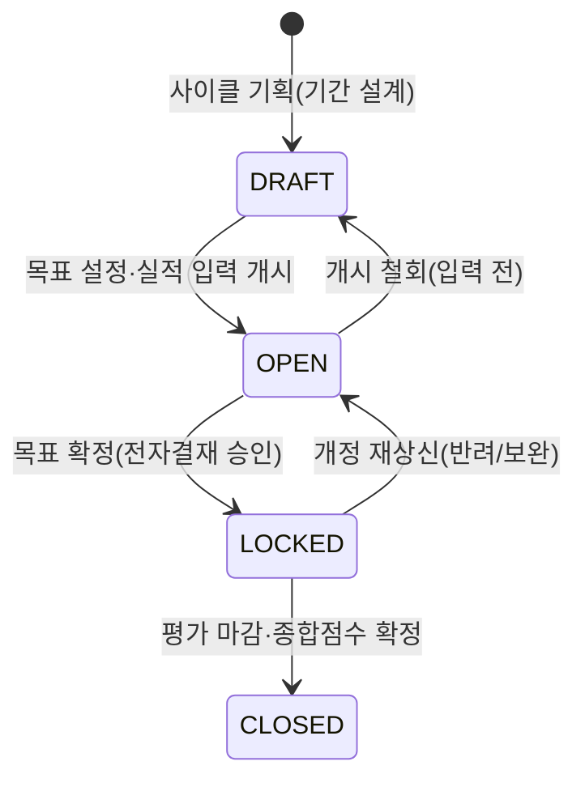

# [3-7-1] MANAGEMENT 조직 성과·KPI 관리 기획서

본 문서는 MANAGEMENT 워크스페이스의 조직/부서 관리 구조 위에서 **조직 단위 성과(KPI)와 임직원 개인 성과를 목표 설정 → 확정 → 실적 입력 → 평가로 이어지는 하나의 주기(사이클)로 관리**하기 위한 화면 및 기능 요건을 명세합니다. 상위 워크스페이스 기획은 [3_7_workspace_management.md](./3_7_workspace_management.md), 조직/부서 버전 구조는 이미 구현된 `조직 관리` 기능을 전제합니다.

---

## 1. 목적
* 매 조직 개편마다 조직 레벨·부서명을 새로 정의하면서도, 그 조직이 무엇을 목표로 삼고 얼마나 달성했는지를 관리하는 **성과관리 프로세스**가 부재한 문제를 해소합니다.
* KPI를 특정 시점 부서가 아닌 **조직 계보(lineage)에 귀속**시켜, 조직 개편(이름·상위 조직 변경)이 발생해도 목표와 달성 이력이 단절 없이 연속되도록 보장합니다.
* 조직 목표(정량 KPI + 정성 목표)를 임직원 개인 목표로 캐스케이드(Cascade)하여, 전사→조직→개인으로 정렬된 목표관리(MBO)형 성과관리를 제공합니다.

---

## 2. 이 문서가 다루는 범위
* **포함**:
  * 성과관리 주기(사이클)의 자유 정의 및 상태 머신 운영
  * 조직 계보 단위 KPI 목표(정량 핵심결과 + 정성 목표) 정의·실적 입력·달성률 산출
  * 조직 목표를 임직원 개인 목표로 연결하는 개인 성과평가(자기평가/상급자 평가)
  * 전자결재(E-Approval) 연동을 통한 목표 확정 및 평가 확정 잠금(`LOCK`)
  * 조직도 트리 위에 사이클별 달성률을 오버레이하는 성과 대시보드
* **제외(별도 범위)**:
  * 급여·보상(연봉/인센티브) 연동 — 본 기획은 성과 데이터 산출까지만 다룹니다.
  * 실적값 자동 집계 파이프라인(재무·매출 지표 자동 연동) — v2 후속 과제로 명시합니다.
  * Supabase 마이그레이션 및 프론트엔드 구현 — 7절은 개념 설계 서술까지만 다룹니다.

---

## 3. 핵심 사용자
* **최고 관리자·경영진 (`super_admin`, 경영진)**: 전사 조직의 사이클별 달성 현황을 조망하고 사이클을 개시·마감합니다.
* **MANAGEMENT 담당 (management write)**: 사이클을 생성·운영하고, 목표 설정 기간과 마감을 통제하며, 미설정 조직을 독려합니다.
* **조직장 (부서 배치된 리더)**: 본인 소속 계보 및 하위 조직의 KPI 목표를 정의·실적 입력하고, 소속 임직원의 개인 목표를 확인·평가합니다.
* **임직원 (내부 직원 전원)**: 본인에게 캐스케이드된 개인 목표와 자기평가를 작성하고, 확정된 본인 평가 결과를 열람합니다.

---

## 4. 정보 구조 (Information Architecture)

`성과·KPI 관리` 탭은 기존 `조직 관리` 탭과 형제 관계로 MANAGEMENT 워크스페이스에 배치되며, 조직도 트리 구조를 공유합니다.

```
[성과·KPI 관리 탭]
 ├── 1. 사이클 선택 바 (현재/예정/종료 사이클 드롭다운 + 상태 배지 + 사이클 생성)
 ├── 2. 조직 KPI 보드 (좌: 조직도 트리 · 우: 선택 조직의 목표/핵심결과/달성률 패널)
 │    ├── 조직 목표 목록 (정량 QUANT / 정성 QUAL, 가중치)
 │    ├── 정량 핵심결과(Key Result): 지표명·단위·목표값·실적값·방향성·달성률
 │    └── 정성 목표: 서술 목표 + 진척 코멘트 + 평가 등급
 ├── 3. 개인 성과평가 (조직 목표 캐스케이드 → 개인 목표 → 자기평가/상급자 평가)
 └── 4. 성과 대시보드 (조직도 트리 위 사이클별 종합점수·달성률 히트맵 오버레이)
```

> [!NOTE]
> 조직도 트리와 조직 소속 판정은 `조직 관리`의 버전 스냅샷(`departments`·`dept_members` × `version_id`/`lineage_id`)을 원천으로 재사용합니다. 성과 데이터는 부서의 시점 id가 아니라 계보(`lineage_id`)에 붙습니다.

---

## 5. 화면 구성

### 5.1 와이어프레임 레이아웃
```
┌────────────────────────────────────────────────────────────────────────┐
│  [성과·KPI 관리]   사이클: [2026 상반기 ▼ · OPEN]   [+ 사이클 생성]      │
├───────────────────────────────────────┬────────────────────────────────┤
│ ■ 조직도 트리                          │ ■ 목표 보드: AC 투자실           │
│  회사                                  │ 종합 달성률: 78% (가중 합산)     │
│   └ AC 사업부                          │ ───────────────────────────────  │
│      ├ AC 투자실  ◀ 선택              │ [정량] 스타트업 신규 보육 (가중 40%)│
│      │   └ 심사1팀                     │   목표 20개사 / 실적 16개사 · 80% ↑│
│      └ 매니지먼트실                    │ [정량] 투자 집행 금액 (가중 30%)  │
│                                        │   목표 50억 / 실적 47억 · 94% ↑   │
│                                        │ [정성] 팀 역량 강화 (가중 30%)    │
│                                        │   진척 코멘트 3건 · 평가 B+       │
│                                        │ [실적 입력] [목표 확정 상신]      │
├───────────────────────────────────────┴────────────────────────────────┤
│ ■ 개인 성과평가 (AC 투자실 · 5명)                                        │
│  홍길동 선임 | 개인목표 3 | 자기평가 완료 | 상급자평가 대기              │
│  [개인 평가 카드 열기]                                                   │
└────────────────────────────────────────────────────────────────────────┘
```

* **사이클 선택 바**: 조직 관리의 `OrgVersionBar` 패턴을 재사용하여 현재/예정/종료 사이클을 `optgroup`으로 그룹핑하고 상태 배지를 노출합니다.
* **조직 KPI 보드**: 좌측은 `조직 관리`의 조직도 트리(읽기 모드), 우측은 선택 조직의 목표 패널로 구성한 2열 레이아웃입니다.
* **개인 평가 카드**: 개인 목표·자기평가·상급자 평가·최종 등급을 담은 모달로 열립니다.

---

## 6. 주요 기능

### 6.1 성과관리 사이클 운영 (Cycle State Machine)
* **기능**: 관리자가 사이클 라벨과 기간(`period_from` ~ `period_to`)을 자유롭게 정의합니다. 연간/반기/분기에 고정되지 않으며, 반복 주기를 강제하지 않습니다.
* **상태 전이**: `DRAFT`(설계) → `OPEN`(목표 설정·실적 입력 개시) → `LOCKED`(목표 확정·수정 잠금) → `CLOSED`(평가 마감). 각 전이는 담당 권한자만 수행합니다.
* **동시성**: 여러 사이클이 기간상 겹칠 수 있으나(예: 연간 + 분기 병행), 화면은 사이클 단위로 완전히 격리하여 데이터 혼선을 방지합니다.

### 6.2 조직 KPI 정의 (하이브리드 목표)
* **정량 목표(`QUANT`)**: 하나의 목표 아래 복수의 핵심결과(Key Result)를 둡니다. 각 핵심결과는 지표명, 단위, 목표값(`target`), 방향성(`UP`=클수록 좋음 / `DOWN`=작을수록 좋음)을 가집니다.
* **정성 목표(`QUAL`)**: 서술형 목표와 진척 코멘트를 기록하고, 마감 시 평가자가 등급(예: `A`/`B`/`C`)을 부여합니다.
* **가중치**: 목표마다 가중치(`weight`)를 부여하여 조직 종합 점수 산출에 반영합니다(가중치 합계 100% 권장, 초과/미달 시 경고 배지).

### 6.3 실적 입력 및 진척 코멘트
* **기능**: 조직장이 사이클 진행 중/말에 정량 핵심결과의 실적값(`actual`)을 입력하고, 정성 목표에 진척 코멘트를 누적 기록합니다.
* **이력 보존**: 실적값은 덮어쓰기가 아닌 개정 이력으로 관리하여 중간 점검 시점의 값을 추적할 수 있도록 합니다.

### 6.4 달성률 및 종합점수 산출
* **정량 달성률**: 방향성에 따라 `UP`은 `actual / target`, `DOWN`은 `target / actual` 기준으로 계산하며 상한(예: 120%)으로 클램프합니다.
* **조직 종합점수**: `Σ(목표 가중치 × 목표 달성률)`로 산출합니다. 정성 목표는 등급을 점수로 환산하여 합산합니다.
* **집계 규칙**: 서버(RPC)에서 계산하여 UI 조작으로 점수를 변조할 수 없도록 강제합니다.

### 6.5 개인 목표 캐스케이드 및 평가
* **캐스케이드**: 조직 목표에서 임직원 개인 목표를 파생·연결합니다(선택적으로 조직 목표 미연계 개인 목표도 허용).
* **소속 판정**: "이 사이클 시점에 임직원이 어느 조직 소속이었는가"는 `dept_members`(사이클 기간에 유효한 조직 버전)를 기준으로 해석하여, 사이클 도중 발령이 있어도 평가 귀속을 명확히 합니다.
* **평가 흐름**: 자기평가(`self_rating`) → 상급자 평가(`manager_rating`) → 코멘트. 발령 이력(`hr_assignments`)·인사 프로필(`hr_profiles`)과 연동합니다.

### 6.6 목표·평가 확정 잠금 (전자결재 연동)
* **기능**: 조직 목표 확정과 개인 평가 확정은 전자결재(E-Approval)로 상신하고, 승인 완료 시 `LOCKED`로 잠급니다.
* **개정 통제**: 승인 후 변경은 재상신을 통한 개정 이력으로만 허용하여 임의 수정을 차단합니다.

### 6.7 성과 대시보드 오버레이
* **기능**: 조직도 트리 위에 선택 사이클의 종합점수·달성률을 히트맵(색상 스케일) 형태로 오버레이하여 조직별 성과를 한눈에 비교합니다.
* **연계**: 기존 재무·KPI 대시보드(`dept_budgets`/`kpi_records`)와 지표 정의가 중복되지 않도록 역할을 구분합니다(12절 참조).

---

## 7. 데이터 모델 (개념 설계)

> [!NOTE]
> 본 절은 개념 설계이며 실제 마이그레이션은 후속 작업으로 분리합니다. 모든 신규 테이블은 RLS 필수·Default Deny를 전제하며, 물리 삭제 없이 `deleted_at` 소프트 삭제를 따릅니다.

```typescript
// 성과관리 주기
interface KpiCycle {
  id: string;
  label: string;                 // 예: "2026 상반기"
  period_from: string;
  period_to: string;
  status: 'DRAFT' | 'OPEN' | 'LOCKED' | 'CLOSED';
  deleted_at: string | null;
}

// 조직 목표 — 조직 계보(lineage)에 귀속 (★ 핵심 원칙)
interface KpiObjective {
  id: string;
  cycle_id: string;              // KpiCycle FK
  dept_lineage_id: string;       // departments.lineage_id 참조 (버전 불변 계보)
  type: 'QUANT' | 'QUAL';
  title: string;
  weight: number;                // 종합점수 가중치(%)
  qual_grade: string | null;     // 정성 목표 마감 등급
  deleted_at: string | null;
}

// 정량 핵심결과
interface KpiKeyResult {
  id: string;
  objective_id: string;          // KpiObjective FK (type=QUANT)
  metric: string;                // 지표명
  unit: string;                  // 단위
  target: number;
  actual: number | null;
  direction: 'UP' | 'DOWN';
}

// 개인 성과평가
interface KpiReview {
  id: string;
  cycle_id: string;
  user_id: string;               // 대상 임직원
  objective_id: string | null;   // 연계 조직 목표(캐스케이드), null=개인 단독 목표
  self_rating: string | null;
  manager_rating: string | null;
  comment: string | null;
  status: 'DRAFT' | 'SUBMITTED' | 'LOCKED';
}
```

* **계보 귀속 근거**: `dept_lineage_id`는 [orgHooks.ts](../../apps/works/src/features/management/orgHooks.ts)의 `Department.lineage_id`를 참조하며, 사이클 시점의 유효 조직 버전 해석은 `current_org_version_id()` 규칙을 재사용합니다.

---

## 8. 상태 모델

사이클 상태(`KpiCycle.status`)는 다음 전이 모델을 가지며, 목표/평가 확정은 전자결재 승인과 매핑됩니다.



* 개인 평가(`KpiReview.status`)는 `DRAFT` → `SUBMITTED`(자기평가 제출) → `LOCKED`(상급자 확정)의 하위 전이를 가집니다.

---

## 9. 권한/RLS
* **조회**: 내부 임직원은 본인 소속 계보 및 상위 조직의 목표를 조회할 수 있으며, `super_admin`·management는 전사 조회가 가능합니다. 외부 게스트는 원천 차단합니다.
* **쓰기(목표/실적)**: 조직장은 본인 소속 계보(`dept_lineage_id`) 및 하위 조직에 한해 목표 정의·실적 입력이 가능합니다.
* **개인 평가**: 자기평가는 본인만, 상급자 평가는 해당 조직의 리더/관리자만 작성 가능합니다.
* **구현 원칙**: RLS는 기저 헬퍼 `current_app_user_id()`/`current_app_role()`을 경유하며(직접 참조 금지), 모든 테이블 Default Deny를 선언합니다. UI 숨김은 보안이 아니므로 서버(RPC/RLS)에서 강제합니다.

---

## 10. API/RPC/서버 액션
* **`fn_upsert_kpi_objective(...)`**: 목표/핵심결과 정의·수정. `LOCKED` 사이클/목표는 거부합니다.
* **`fn_input_kpi_actual(...)`**: 실적값 입력(개정 이력 적재). 조직장 권한 및 계보 범위를 검증합니다.
* **`fn_calc_org_score(p_cycle_id, p_dept_lineage_id)`**: 가중 달성률 기반 조직 종합점수를 서버에서 산출·반환합니다.
* **`fn_submit_approval(...)`**: 목표/평가 확정을 전자결재로 상신하고, 승인 콜백에서 상태를 `LOCKED`로 전이합니다.
* **보안 검증**: 모든 함수는 호출자 역할·계보 범위를 검증하고, 확정/개정 등 민감 액션은 감사 로그(`audit_logs`)에 적재합니다.

---

## 11. GUEST 연동
* 내부 성과·평가 데이터이므로 GUEST 포털에는 **일체 노출하지 않습니다.** 관련 테이블은 게스트 역할에 대해 RLS로 원천 차단합니다.

---

## 12. HUB/ADMIN/타 워크스페이스 연동
* **전자결재(E-Approval)**: 목표 확정·평가 확정을 결재 문서로 상신하고 승인 시 잠금 처리합니다(6.6).
* **ADMIN 감사 로그**: 사이클 개시/마감, 목표 확정, 평가 확정 등 민감 액션은 ADMIN 감사 로그에 실행자·대상 정보를 적재합니다.
* **재무·KPI 대시보드와의 역할 구분**: 기존 재무·KPI 대시보드(`dept_budgets`/`kpi_records`)는 *예산 대비 실지출 관제* 중심이며, 본 기능은 *목표 설정→실적→평가의 성과관리 사이클* 중심입니다. 지표 정의가 중복될 경우 본 기능의 정량 핵심결과가 상위 정의를 갖고, 재무 실적값을 참조(읽기)하는 방향으로 정리합니다.
* **HRM/HRD 연동**: 개인 평가는 인사 프로필(`hr_profiles`)·발령 이력(`hr_assignments`)과 연동하며, 사이클 시점 소속은 `dept_members`로 해석합니다.

---

## 13. 예외/오류/운영 리스크
* **사이클 진행 중 조직 개편 발생(★ 핵심 리스크)**: 목표를 부서 시점 id가 아닌 계보(`dept_lineage_id`)에 귀속시켜, 개편으로 부서명·상위 조직이 바뀌어도 목표·실적이 동일 조직으로 이어지도록 합니다. 조직이 분할/통합되어 계보가 갈라지는 경우에는 담당자가 목표 이관을 명시적으로 결정하도록 안내 배너를 노출합니다.
* **목표 미설정 조직**: 사이클 `OPEN` 후 목표가 없는 조직은 대시보드에 미설정 배지로 표시하고 관리자에게 독려 알림을 제공합니다.
* **실적 결측**: 마감 시점 실적값이 비어 있는 핵심결과는 종합점수 계산에서 제외하되, 결측 사실을 명시적으로 표기합니다.
* **결재 반려·재상신**: 목표/평가가 반려되면 `LOCKED`에서 `OPEN`으로 되돌리고 개정 이력을 남깁니다.
* **정성 평가 주관성**: 정성 목표 등급은 평가자 코멘트 근거를 필수화하여 주관성 편차를 완화합니다.

---

## 14. 완료 기준 (Definition of Done)
1. 관리자가 임의 기간의 사이클을 생성하고 `DRAFT`→`OPEN`→`LOCKED`→`CLOSED` 상태 전이가 권한자에 한해 작동하는가?
2. 조직 목표가 부서 시점 id가 아닌 계보(`dept_lineage_id`)에 저장되어, 조직 개편 후에도 목표·실적이 동일 조직으로 연속 조회되는가?
3. 정량 핵심결과의 방향성(`UP`/`DOWN`)에 따른 달성률과 가중 종합점수가 서버에서 정확히 산출되는가?
4. 조직 목표가 개인 목표로 캐스케이드되고, 사이클 시점 소속(`dept_members`) 기준으로 개인 평가가 올바른 조직에 귀속되는가?
5. 목표/평가 확정이 전자결재 승인으로 `LOCKED` 처리되고, 승인 후 임의 수정이 차단되는가?
6. 외부 게스트 계정으로 성과 API 호출 시 RLS에 의해 정상 차단되는가?

---

## 15. 테스트 기준
1. **RLS 테스트**: 외부 게스트 및 타 조직 임직원 토큰으로 목표/평가 조회·쓰기를 시도하여 계보 범위 밖 접근이 차단되는지 확인합니다.
2. **계보 귀속(개편 연속성) 테스트**: 사이클 진행 중 조직 개편(부서명·상위 변경)을 발생시킨 뒤, 개편 전 입력한 목표·실적이 개편 후 동일 계보로 그대로 조회되는지 확인합니다.
3. **종합점수 집계 정밀도 테스트**: 방향성·가중치가 다른 복수 목표에 실적값을 입력한 뒤, `fn_calc_org_score`의 반환값이 수식(가중 합산·클램프)과 소수점 자리까지 일치하는지 확인합니다.
4. **결재 LOCK 시나리오 테스트**: 목표 확정 상신→승인 후 목표 수정 시도가 거부되고, 반려 시 `OPEN`으로 복귀하며 개정 이력이 남는지 확인합니다.
5. **개인 소속 판정 테스트**: 사이클 도중 발령된 임직원의 개인 평가가 `dept_members` 기준의 올바른 사이클 시점 조직에 귀속되는지 확인합니다.
