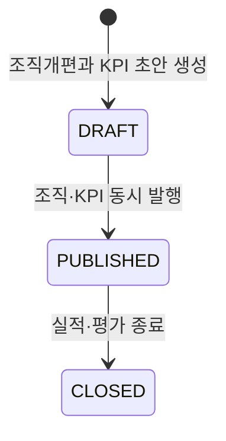

# [3-7-1] MANAGEMENT 조직 성과·KPI 관리 기획서

본 문서는 조직 원장의 적용기간과 같은 경계에서 KPI 기준을 끊어 관리하고, 부서 KPI와 개인 KPI를 임직원에게 함께 보여 주는 성과관리 기능을 정의합니다. 실제 「2026년 KPI 세부기준」은 최초 입력 사례일 뿐이며, 제품에는 해당 연도의 항목과 수치를 고정하지 않습니다. 관리자가 KPI 구성 원형을 만들고 각 조직 버전에 내용을 채워 발행하는 구조를 정본으로 삼습니다.

> [!IMPORTANT]
> **KPI는 조직 계보에 연속 귀속하지 않습니다.** 조직개편 발효일은 기존 조직·KPI 스냅샷의 종료일이자 새 조직·KPI 스냅샷의 시작일입니다. 이전 스냅샷의 정의·목표·실적·점수는 새 스냅샷 계산에 반영하지 않습니다.

---

## 1. 목적

* **연도·조직별 변화 수용**: KPI 항목·목표·배점·점수 규칙을 코드가 아닌 데이터로 구성하여 매년 또는 조직개편 때 다시 설계할 수 있게 합니다.
* **두 KPI의 명확한 귀속**: 부서 KPI는 부서에, 개인 KPI는 임직원에게 직접 귀속합니다. 임직원은 두 결과를 함께 보되 원천과 점수는 섞지 않습니다.
* **스냅샷 경계 보존**: 조직개편 전후의 KPI를 독립된 사실로 보존하며 과거 기준 변경이 현재 결과를 흔들지 않게 합니다.
* **부서이동 대응**: 개인 KPI는 유지하고, 부서 KPI만 이동 적용일을 기준으로 새 소속 부서의 KPI를 상속합니다.
* **OFFICE 일상 조회**: MANAGEMENT에서 설계·할당한 결과를 OFFICE 대시보드의 `나의 KPI`와 `소속 부서 KPI`로 제공합니다.

---

## 2. 확정 원칙

1. **조직 버전과 KPI 버전은 1:1입니다.** KPI 버전은 독립 적용기간을 갖지 않고 연결된 `org_versions`의 `effective_from`·`effective_to`를 그대로 사용합니다.
2. **조직개편과 KPI 개편은 한 번에 발행합니다.** 조직만 또는 KPI만 먼저 발행할 수 없습니다.
3. **발행된 KPI 정의는 불변입니다.** 기준을 바꾸려면 새 조직·KPI 스냅샷을 만들어 새 적용일부터 발행합니다.
4. **복제는 초안 생성 수단입니다.** 이전 구성이나 내용을 복제해도 새 행으로 복사할 뿐 원본과 실시간으로 연결하지 않습니다.
5. **개인 KPI는 사람에게 직접 귀속합니다.** 같은 KPI 스냅샷 안에서 부서이동이 발생해도 개인 KPI 할당은 바뀌지 않습니다.
6. **부서 KPI는 사람에게 복사하지 않습니다.** 조회 기준일의 소속 부서를 통해 해당 부서의 KPI를 동적으로 상속합니다.
7. **부서이동은 기간 이력입니다.** 이동 전 결과는 이전 부서에 남고 이동일부터 새 부서 KPI를 봅니다.
8. **스냅샷 간 점수는 자동 합산하지 않습니다.** 한 해에 조직개편이 여러 번 있어도 각 구간의 결과를 별도로 표시합니다. 통합 평가가 필요해지면 별도의 가중 정책을 명시적으로 추가합니다.

---

## 3. 용어와 구조

```text
KPI 구성 원형(Blueprint)
  └─ 조직개편 초안에 복제
       └─ KPI 버전(KpiVersion, OrgVersion과 1:1)
            ├─ 부서용 KPI 템플릿
            │    └─ 부서에 직접 할당
            └─ 개인용 KPI 템플릿
                 └─ 임직원에게 직접 할당

임직원이 기준일에 보는 KPI
  = 본인에게 할당된 개인 KPI
  + 기준일 소속 부서에 할당된 부서 KPI
```

* **구성 원형(Blueprint)**: KPI 문서를 만들 때 반복해서 쓰는 섹션·항목 자리·입력 방식의 골격입니다. 발행된 결과를 직접 지배하지 않습니다.
* **KPI 버전(KpiVersion)**: 특정 조직 버전에 채워 넣은 KPI 기준 전체입니다. 적용기간은 조직 버전에서 파생합니다.
* **KPI 템플릿(Template)**: 한 대상군에 적용할 항목 묶음입니다. `DEPARTMENT`와 `PERSON` 두 종류가 있습니다.
* **KPI 할당(Assignment)**: 발행할 템플릿과 실제 부서 또는 임직원의 연결입니다.
* **배치 구간(Placement Segment)**: 임직원이 어느 날짜부터 어느 날짜 전까지 어느 부서에 있었는지를 나타내는 반열림 기간 `[from, to)`입니다.

---

## 4. 사용자와 권한

* **KPI 관리자**: 구성 원형, KPI 버전, 템플릿, 항목, 점수 규칙, 부서·개인 할당을 편집하고 조직개편과 함께 발행합니다.
* **경영진**: 전사·부서 결과와 상대평가·등급·지급률을 조회하고 최종 확정합니다.
* **조직장**: 본인 부서 KPI의 실적·증빙을 입력하고 소속 임직원의 평가 항목을 처리합니다.
* **임직원**: OFFICE에서 본인 개인 KPI와 기준일 소속 부서 KPI를 조회하고, 허용된 개인 실적·증빙을 입력합니다.
* **외부 사용자**: KPI 정의·실적·점수·등급에 접근할 수 없습니다.

---

## 5. MANAGEMENT 화면 정보 구조

`/management?tab=kpi`는 기존 `kpi_records` 단일 표를 제거하고 다음 순서의 작업 화면으로 교체합니다.

```text
[KPI 관리]
  조직/KPI 기준: [2026 조직 · 2026.01.01~2026.06.30]
  상태: [초안/발행/종료]   [새 조직개편에서 KPI 만들기]

  [현황] [구성·템플릿] [부서 할당] [개인 할당] [실적·평가]
```

### 5.1 공통 버전 바

* 조직 버전과 KPI 버전을 한 선택지로 표시합니다. 별도의 연도·사이클 선택기를 만들지 않습니다.
* 표시값은 `조직 버전명 · 적용기간 · KPI 상태`이며 과거 버전 선택 시 읽기 전용으로 전환합니다.
* KPI 버전이 없는 조직 초안에는 `KPI 구성 시작` 빈 상태를 표시합니다.
* 발행된 조직에서 `수정`을 누르면 직접 수정하지 않고 `새 조직개편 만들기`로 안내합니다.

### 5.2 현황

* 부서 할당 완료율, 개인 할당 완료율, 미할당 대상, 구성 오류, 증빙 누락, 실적 입력률을 요약합니다.
* 조직 트리에서 부서를 선택하면 해당 부서 템플릿과 구성원 개인 할당 현황을 함께 보여 줍니다.
* `미할당`, `중복 기본 할당`, `점수 구간 공백`, `배점 누락`은 발행 전 차단 항목으로 구분합니다.

### 5.3 구성·템플릿 빌더

왼쪽은 템플릿과 섹션 구조, 오른쪽은 선택 항목의 내용을 편집합니다.

```text
┌ 템플릿 ─────────────────────┬ 항목 편집 ─────────────────────────┐
│ AC본부 부서 KPI             │ 지표명       [매출 KPI]             │
│  ├ 재무 성과                │ 단위         [%]                    │
│  │  ├ 매출 KPI              │ 입력 기준    [목표 대비 달성률]     │
│  │  └ 이익률 KPI            │ 점수 방식    [구간형]               │
│  └ 운영 성과                │ 구간/점수    [행 추가 가능한 표]    │
│     └ 언론기사              │ 증빙         [필수]                 │
│ [+ 섹션] [+ 항목]           │ [저장] [항목 복제]                 │
└─────────────────────────────┴─────────────────────────────────────┘
```

* 구성 원형에서는 섹션과 항목 자리, 입력·점수 방식만 정할 수 있습니다.
* KPI 버전의 템플릿에서는 지표명·설명·인정 기준·단위·목표·구간·배점·각주 등 실제 내용을 채웁니다.
* `이전 구성만 복제`와 `이전 구성+내용 복제`를 구분합니다. 어느 쪽이든 새 스냅샷으로 복사합니다.
* 항목 순서와 섹션은 드래그로 배치하되 발행 후에는 바꿀 수 없습니다.

### 5.4 부서 할당

* 왼쪽 조직 트리에서 부서를 선택하고 오른쪽에서 `DEPARTMENT` 템플릿을 할당합니다.
* 대상은 반드시 선택 조직 버전의 `departments.id`입니다. `lineage_id`로 할당하지 않습니다.
* 모든 평가 대상 부서는 기본 템플릿 하나를 가져야 합니다. 보조 템플릿은 추가로 허용합니다.
* 할당별 목표값을 덮어쓸 수 있습니다. 예를 들어 같은 매출 KPI라도 부서마다 목표 금액을 다르게 둡니다.
* 상위 부서 템플릿을 하위 부서에 자동 전파하지 않습니다. 일괄 적용은 여러 부서에 독립 할당 행을 만드는 편의 기능입니다.

### 5.5 개인 할당

* 임직원 목록은 조직·직급·직책으로 필터링하고 개인용 템플릿을 일괄 또는 개별 할당합니다.
* 소속·직급·직책은 자동 추천 조건일 뿐 최종 할당은 관리자 확정으로 만듭니다.
* 기본 개인 템플릿 하나와 선택적 보조 템플릿을 허용합니다.
* 개인 할당은 `user_id`에 귀속하므로 같은 KPI 버전 안에서 부서이동 RPC가 이를 수정하지 않습니다.
* 부서이동한 임직원은 개인 할당 화면에서 기존 템플릿이 유지된다는 상태를 표시합니다.

### 5.6 실적·평가

* `부서`와 `개인` 두 보기를 제공하며 항목별 목표·실적·산출점수·증빙·확정 상태를 표시합니다.
* 점수는 서버 함수가 계산하며 화면에서 직접 입력하거나 덮어쓰지 않습니다.
* 실적 개정은 기존 값을 갱신하지 않고 개정 행으로 남깁니다.
* 상대평가·등급·지급률은 해당 KPI 스냅샷 안의 대상만 비교합니다.

---

## 6. KPI 항목과 점수 엔진

제품이 고정 제공하는 것은 아래의 범용 구성 요소뿐이며, 2026년 항목명과 수치는 데이터로 입력합니다.

* **구간형(`BAND`)**: 값 또는 달성률이 속한 구간의 점수를 반환합니다. 음수 점수, 열린 상한, 단계별 가산, 최소·최대 클램프를 지원합니다.
* **건당 합산형(`PER_UNIT_CAP`)**: 세부 건수마다 점수를 곱해 합산하고 총점 상한을 적용합니다.
* **등급형(`GRADE_MAP`)**: 정성 점수나 S~D 등의 선택값을 점수로 매핑합니다.
* **목표 대비(`TARGET_RATE`)**: `actual / target`을 계산한 뒤 연결된 점수 규칙에 투입합니다.
* **절대값(`ABSOLUTE`)**: 금액·건수·명수 등 입력값 자체를 점수 규칙에 투입합니다.

항목은 다음 정보를 가집니다.

* 지표명, 설명, 인정 기준, 단위, 정량/정성 구분
* 입력 방식, 목표 방식, 점수 규칙과 파라미터
* 기본 목표값, 할당별 목표값, 최대점수, 정렬순서
* 증빙 필수 여부와 인정 기준 각주

점수 규칙의 구간 겹침·공백, 닫히지 않은 범위, 음수·상한 설정, 목표 0, 최대점수 불일치는 저장과 발행 단계에서 검증합니다.

---

## 7. 데이터 모델

### 7.1 조직과 1:1인 KPI 스냅샷

```typescript
interface KpiVersion {
  id: string
  org_version_id: string              // UNIQUE, org_versions.id
  source_version_id: string | null    // 복제 출처 감사용, 계산에는 미사용
  label: string
  status: 'DRAFT' | 'PUBLISHED' | 'CLOSED'
  published_at: string | null
  published_by: string | null
  deleted_at: string | null
}
```

* 적용기간 컬럼은 두지 않습니다. 연결된 `org_versions`가 기간의 단일 원천입니다.
* `PUBLISHED` 이후 KPI 정의·템플릿·항목·할당은 UPDATE하지 않습니다.
* `source_version_id`는 어디서 복제했는지만 설명하며 원본 변경을 전파하지 않습니다.

### 7.2 재사용 구성 원형

```typescript
interface KpiBlueprint {
  id: string
  name: string
  scope_type: 'DEPARTMENT' | 'PERSON'
  description: string | null
  is_active: boolean
}

interface KpiBlueprintItem {
  id: string
  blueprint_id: string
  section_key: string
  slot_key: string
  input_type: 'NUMBER' | 'GRADE' | 'MULTI_COUNT'
  target_mode: 'TARGET_RATE' | 'ABSOLUTE' | 'NONE'
  rule_type: 'BAND' | 'PER_UNIT_CAP' | 'GRADE_MAP'
  sort_order: number
}
```

구성 원형 수정은 이후 생성하는 초안에만 적용됩니다. 이미 생성되거나 발행된 KPI 템플릿은 바뀌지 않습니다.

### 7.3 버전별 템플릿과 항목

```typescript
interface KpiTemplate {
  id: string
  kpi_version_id: string
  source_blueprint_id: string | null
  name: string
  scope_type: 'DEPARTMENT' | 'PERSON'
  role_hint: string | null
  is_primary: boolean
}

interface KpiTemplateItem {
  id: string
  template_id: string
  section_label: string
  metric_code: string
  metric_name: string
  description: string | null
  criteria_text: string | null          // 인정 범위·제외 조건·산정 기준
  unit: string | null
  input_type: 'NUMBER' | 'GRADE' | 'MULTI_COUNT'
  target_mode: 'TARGET_RATE' | 'ABSOLUTE' | 'NONE'
  rule_type: 'BAND' | 'PER_UNIT_CAP' | 'GRADE_MAP'
  rule_params: object
  default_target: number | null
  max_score: number | null
  evidence_required: boolean
  sort_order: number
}
```

지표명과 규칙을 템플릿 항목에 스냅샷으로 저장하므로 공용 원형을 고쳐도 과거 KPI가 변하지 않습니다.

### 7.4 부서·개인 할당

```typescript
interface KpiAssignment {
  id: string
  kpi_version_id: string
  template_id: string
  subject_type: 'DEPARTMENT' | 'PERSON'
  department_id: string | null         // 조직 버전 안의 시점 부서 id
  user_id: string | null               // 임직원 직접 귀속
  assignment_kind: 'PRIMARY' | 'SUPPLEMENTAL'
  target_overrides: object | null
  created_at: string
}
```

* `subject_type`에 따라 `department_id`와 `user_id` 중 하나만 존재해야 합니다.
* 부서 할당의 `department_id`는 KPI 버전이 연결된 조직 버전의 부서여야 합니다.
* 템플릿 스코프와 할당 대상 종류는 반드시 일치해야 합니다.
* 한 대상의 `PRIMARY` 할당은 스코프별 하나만 허용합니다.

### 7.5 실적·증빙·결과

```typescript
interface KpiActualRevision {
  id: string
  assignment_id: string
  template_item_id: string
  actual_value: number | null
  qualitative_value: string | null
  evidence_ref: string | null
  revision_no: number
  entered_by: string
  entered_at: string
}

interface KpiResult {
  id: string
  assignment_id: string
  calculated_score: number
  rank: number | null
  grade: string | null
  payout_rate: number | null
  rule_snapshot: object
  calculated_at: string
  locked_at: string | null
}
```

결과 행에는 사용한 규칙 스냅샷을 남겨 같은 입력으로 같은 결과를 재현할 수 있게 합니다.

---

## 8. 임직원 배치 기간 모델

현재 `dept_members`는 `(version_id, user_id)`당 한 행이라 같은 조직 버전 안의 중도 부서이동 전후를 함께 보존할 수 없습니다. KPI 상속을 위해 다음과 같이 기간형 원장으로 확장합니다.

```typescript
interface DepartmentMembership {
  id: string
  version_id: string
  department_id: string
  user_id: string
  effective_from: string
  effective_to: string | null          // 반열림 [from, to)
  created_at: string
  deleted_at: string | null
}
```

* 같은 임직원의 유효기간은 서로 겹칠 수 없습니다.
* 배치 기간은 연결된 조직 버전의 기간 밖으로 나갈 수 없습니다.
* 부서이동 RPC는 기존 배치의 `effective_to`를 이동일로 닫고 새 부서 배치를 같은 날 시작합니다.
* `hr_assignments`는 인사발령 사건과 사유를 남기는 이력이며, 실제 소속 판정은 기간형 `dept_members`를 단일 원천으로 사용합니다.
* 조직 버전 복제 시 새 발효일에 유효한 배치 한 건만 새 조직 버전으로 복사합니다.

기준일 `D`의 부서 KPI는 다음 순서로 구합니다.

1. `D`가 속하는 `org_versions`와 연결된 `kpi_versions`를 찾습니다.
2. `dept_members.effective_from <= D < effective_to`인 임직원 배치를 찾습니다.
3. 그 배치의 정확한 `department_id`에 할당된 `DEPARTMENT` KPI를 찾습니다.
4. 임직원에게 별도로 할당된 `PERSON` KPI를 함께 반환합니다.

`lineage_id`는 조직 간 대응과 복제 보조에만 사용하며 KPI 조회·실적·점수의 귀속 키로 사용하지 않습니다.

---

## 9. 조직개편과 동시 발행

조직개편 화면에 `KPI 개편` 단계를 추가합니다.

```text
1. 기본정보와 발효일
2. 조직 구조
3. 임직원 배치
4. KPI 구성·내용
5. 부서 KPI 할당
6. 개인 KPI 할당
7. 검증 및 동시 발행
```

`publish_org_and_kpi_version(org_version_id)` RPC는 한 트랜잭션에서 다음을 처리합니다.

* 새 조직 버전과 연결된 KPI 버전이 모두 `DRAFT`인지 확인합니다.
* 모든 평가 대상 부서와 재직 임직원의 기본 KPI 할당 여부를 확인합니다.
* KPI 구성 오류와 기간·배치 겹침이 없는지 확인합니다.
* 직전 조직·KPI 버전의 종료 경계를 새 발효일로 확정합니다.
* 새 조직 버전과 KPI 버전을 함께 `PUBLISHED`로 전환합니다.
* 발행자·발행시각과 감사 로그를 기록합니다.

하나라도 실패하면 조직과 KPI 어느 쪽도 발행하지 않습니다.

---

## 10. 부서이동 동작

예를 들어 임직원이 2026년 7월 1일 A부서에서 B부서로 이동하면 다음과 같습니다.

```text
개인 KPI  [──────────────── 같은 개인 할당 유지 ────────────────]
부서 KPI  [A부서 KPI · 01.01~06.30] │ [B부서 KPI · 07.01~      ]
```

* 개인 KPI 할당·실적·점수는 변경하지 않습니다.
* A부서에서 근무한 기간과 당시 열람한 부서 KPI 이력은 그대로 남습니다.
* 이동일부터 OFFICE의 `소속 부서 KPI`는 B부서 KPI로 바뀝니다.
* 부서 KPI 자체의 실적은 부서에 귀속하므로 이동한 개인에게 복사하거나 분할하지 않습니다.
* 연간 화면에서 두 부서 구간을 나란히 보여 줄 수 있지만 하나의 점수로 임의 합산하지 않습니다.

---

## 11. OFFICE KPI 대시보드

OFFICE 대시보드의 기존 `나의 워크스페이스`와 `나의 데이터베이스` 카드를 제거하고 같은 자리에 다음 두 카드를 배치합니다.

### 11.1 나의 KPI

* 현재 KPI 버전명과 적용기간
* 개인 KPI 템플릿명
* 전체 항목 수, 실적 입력 완료 수, 증빙 누락 수
* 현재 산출점수·등급·진행률. 확정 전 값은 `예상`으로 표시
* 항목별 목표·실적·점수·상태와 증빙 진입

### 11.2 소속 부서 KPI

* 기준일의 소속 부서명과 부서이동 적용일
* 부서 KPI 템플릿명
* 부서 전체 달성률·점수·순위·등급
* 항목별 목표·실적·점수·입력 상태
* 부서이동이 있으면 이전 부서 구간을 `이전 소속 KPI` 이력으로 분리

두 카드의 점수를 합쳐 하나의 종합점수처럼 표시하지 않습니다. 합산 비율이 정의되는 경우에만 별도 정책과 라벨을 추가합니다.

### 11.3 KPI 기준 상세 모달

`나의 KPI`와 `소속 부서 KPI`의 각 항목 행 전체를 누를 수 있게 하고, 선택한 KPI의 기준을 읽기 전용 모달로 표시합니다. 항목명 옆에 별도 정보 아이콘만 두면 누를 수 있는 영역이 작고 현황 행과 설명의 관계가 약해지므로 행 전체를 진입점으로 사용합니다.

```text
┌ 매출 KPI ────────────────────────────────────────────────┐
│ 설명        이 KPI가 측정하는 성과와 목적                 │
│ 인정 기준   포함·제외 조건, 산정 시점, 증빙 요건          │
│ 목표/실적   25억원 / 21.6억원  · 달성률 86.4%             │
│ 점수 기준   80% 초과~100% 이하 60점 …                     │
│ 현재 산출   86.4%가 해당 구간에 포함되어 60점             │
│ 증빙        필수 · 연결된 전자문서                         │
└───────────────────────────────────────────────────────────┘
```

* **설명**: 지표의 목적과 무엇을 측정하는지를 표시합니다.
* **인정 기준**: 집계 범위, 포함·제외 조건, 산정 시점, 증빙 요건을 표시합니다.
* **점수 기준**: `BAND`는 구간표, `PER_UNIT_CAP`은 항목별 건당 점수와 합계 상한, `GRADE_MAP`은 등급별 점수표로 렌더링합니다.
* **현재 산출 근거**: 현재 실적이 어떤 계산과 구간을 거쳐 점수가 되었는지를 한 문장으로 표시합니다. 실적 미입력 시에는 점수를 만들지 않고 `실적 입력 전`으로 표시합니다.
* **스냅샷 표시**: 모달 하단에 조직/KPI 버전명과 적용기간을 표시합니다. 과거 현황에서 연 모달은 당시 템플릿 항목의 설명·기준·점수표만 읽습니다.
* **동작**: 모달은 OFFICE에서 읽기 전용이며 `Esc`, 닫기 버튼, 바깥 영역 클릭으로 닫힙니다. 내부의 증빙 링크만 별도 진입 동작을 가집니다.

권한이 없는 MANAGEMENT 화면으로 보내지 않도록 OFFICE용 조회 RPC를 둡니다. RPC는 현재 로그인한 임직원의 개인 할당과 기준일 소속 부서 할당만 반환하며, 과거 조회도 실제 재직 구간이 있던 부서로 제한합니다.

---

## 12. 상태와 수정 규칙


```mermaid
stateDiagram-v2
    [*] --> DRAFT : 조직개편과 KPI 초안 생성
    DRAFT --> PUBLISHED : 조직·KPI 동시 발행
    PUBLISHED --> CLOSED : 실적·평가 종료
```

* **`DRAFT`**: 구성·내용·할당을 자유롭게 편집할 수 있습니다.
* **`PUBLISHED`**: 정의와 할당은 불변이며 실적·증빙 입력과 점수 계산만 허용합니다.
* **`CLOSED`**: 실적과 결과까지 잠그고 조회만 허용합니다.
* 발행 기준 오류는 새 스냅샷으로 정정합니다. 실적 오입력은 개정 이력으로 정정합니다.

---

## 13. RLS·감사·보안

* 모든 신규 원장은 RLS를 활성화하고 Default Deny를 적용합니다.
* KPI 정의·할당·발행은 `super_admin` 또는 MANAGEMENT 쓰기 권한자만 수행합니다.
* 임직원은 본인의 개인 KPI와 실제 소속 기간에 해당하는 부서 KPI만 조회합니다.
* 조직장은 관리 범위의 부서 실적만 입력하고, 개인 평가자는 지정된 평가 항목만 입력합니다.
* 점수 계산·상대평가·발행·마감은 서버 RPC에서 권한과 상태를 다시 검증합니다.
* 구성·규칙·할당 변경, 동시 발행, 실적 확정, 등급·지급률 확정은 감사 로그에 남깁니다.
* 외부 게스트와 공개 링크에는 KPI 데이터를 제공하지 않습니다.

---

## 14. 구현 순서

1. 기존 `kpi_records` 읽기 경로를 폐기하고 신규 KPI 원장 마이그레이션을 추가합니다.
2. `dept_members`를 기간형 배치 원장으로 확장하고 부서이동 RPC를 만듭니다.
3. 조직개편 복제·발행 RPC에 KPI 초안 생성과 동시 발행을 결합합니다.
4. 범용 점수 엔진과 구성 검증 함수를 구현합니다.
5. MANAGEMENT KPI 버전 바·빌더·부서 할당·개인 할당·실적 화면을 구현합니다.
6. OFFICE의 두 기존 카드를 KPI 대시보드 두 카드로 교체합니다.
7. RLS·감사 로그·경계일·부서이동 회귀 테스트를 완료합니다.

---

## 15. 검증 기준

1. **스냅샷 독립성**: 이전 KPI를 복제해 새 초안을 만든 뒤 새 항목을 수정해도 이전 버전의 정의·실적·점수가 변하지 않아야 합니다.
2. **경계 차단**: 조직개편 발효일 전 조회는 이전 조직·KPI를, 발효일부터는 새 조직·KPI만 반환해야 합니다.
3. **동시 발행**: KPI 미할당 부서나 임직원이 있으면 조직개편 발행 전체가 롤백되어야 합니다.
4. **개인 KPI 유지**: 같은 조직 버전 안에서 부서이동 후에도 개인 KPI 할당 id와 실적이 유지되어야 합니다.
5. **부서 KPI 전환**: 이동일 전날에는 A부서, 이동일에는 B부서 KPI가 반환되어야 합니다.
6. **과거 보존**: 부서이동 후 과거 기준일 조회에서 당시 부서 KPI와 소속이 재현되어야 합니다.
7. **중복 기간 차단**: 한 임직원에게 겹치는 두 부서 배치 구간을 저장할 수 없어야 합니다.
8. **점수 엔진**: 2026년 문서의 구간형·건당 상한·등급형 사례를 골든 케이스로 사용해 점수가 일치해야 합니다.
9. **OFFICE 노출**: 임직원에게 본인 개인 KPI와 기준일 소속 부서 KPI 두 종류만 표시되어야 합니다.
10. **기준 상세 모달**: 현황 행을 누르면 해당 스냅샷의 설명·인정 기준·전체 점수표·현재 산출 근거가 표시되어야 하며, 이후 버전의 기준을 읽어 오면 안 됩니다.
11. **권한 차단**: 다른 임직원의 개인 KPI와 재직하지 않은 부서의 비공개 결과를 직접 API로 읽을 수 없어야 합니다.
